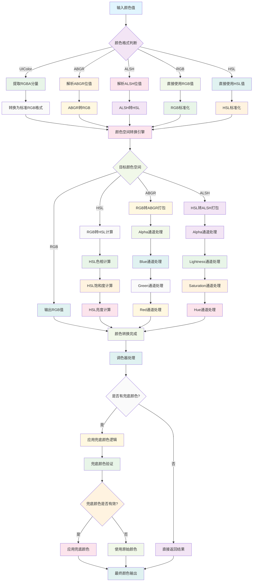

# ColorPalette

一个功能完善的iOS颜色调色板框架，提供完整的颜色处理、转换和调色功能。

## 功能特性

- **颜色空间转换**: 支持RGB、HSL、ABGR、ALSH等多种颜色空间之间的相互转换
- **调色器协议**: 基于协议导向设计，支持自定义调色器实现
- **兜底颜色管理**: 提供兜底颜色设置和获取功能，确保颜色显示的一致性
- **高性能计算**: 使用C函数实现核心颜色转换算法，性能优异
- **内存安全**: 支持ARC内存管理，避免内存泄漏

## 工作原理流程图



## 技术实现

### 核心架构
- **协议导向设计**: 通过`ColorPalette`协议定义调色器接口
- **C函数优化**: 核心颜色转换使用C函数实现，提升性能
- **颜色空间模型**: 支持RGB、HSL、ABGR、ALSH四种颜色空间
- **位操作优化**: 使用位操作进行颜色值的打包和解包

### 实现原理

#### 颜色空间转换
- **RGB ↔ HSL**: 基于数学公式的颜色空间转换算法
- **ABGR格式**: 32位整数存储，A(8位) + B(8位) + G(8位) + R(8位)
- **ALSH格式**: 32位整数存储，A(8位) + L(8位) + S(8位) + H(8位)

#### 调色器机制
- 通过`ColorPalette`协议定义调色接口
- 支持兜底颜色设置，确保颜色显示的一致性
- 可扩展的调色器实现，支持自定义调色逻辑

## 使用示例

### 基础颜色转换
```objc
// RGB转ABGR
UIColor *color = [UIColor redColor];
uint32_t abgr = UIColor_to_abgr(color);

// ABGR转UIColor
UIColor *convertedColor = abgr_to_UIColor(abgr);

// RGB转HSL
float r = 1.0, g = 0.0, b = 0.0;
float h, s, l;
rgb2hsl(r, g, b, &h, &s, &l);
```

### 调色器使用
```objc
// 创建调色器
ColorPalette *palette = [[ColorPalette alloc] init];

// 设置兜底颜色
[palette setColor:[UIColor redColor] spare:[UIColor blueColor]];

// 获取兜底颜色
UIColor *spareColor = [palette spareColor:[UIColor redColor]];

// 执行调色
UIColor *adjustedColor = [palette palette:[UIColor redColor]];
```

### ALSH颜色空间操作
```objc
// 创建ALSH颜色
id<ColorALSH> alshColor = [[ColorALSH alloc] init];
alshColor.H = @(0);      // 色相 0-360
alshColor.S = @(100);    // 饱和度 0-100
alshColor.L = @(50);     // 亮度 0-100
alshColor.A = @(100);    // 透明度 0-100

// ALSH转UIColor
uint32_t alsh = alsh_seal(100, 50, 100, 0);
UIColor *color = alsh_to_UIColor(alsh);
```

## 核心API

### 颜色转换函数
- `UIColor_to_abgr(UIColor *)`: UIColor转ABGR格式
- `abgr_to_UIColor(uint32_t)`: ABGR格式转UIColor
- `UIColor_to_alsh(UIColor *)`: UIColor转ALSH格式
- `alsh_to_UIColor(uint32_t)`: ALSH格式转UIColor

### 颜色空间转换
- `rgb2hsl(float, float, float, float*, float*, float*)`: RGB转HSL
- `hsl2rgb(float, float, float, float*, float*, float*)`: HSL转RGB

### 调色器接口
- `palette(UIColor *)`: 执行调色操作
- `spareColor(UIColor *)`: 获取兜底颜色
- `setColor:spare:`: 设置兜底颜色

## 性能特点

- **高效转换**: C函数实现，避免Objective-C方法调用开销
- **位操作优化**: 使用位操作进行颜色值处理
- **内存友好**: 支持ARC，自动内存管理
- **线程安全**: 纯函数实现，无状态依赖

## 适用场景

- **UI设计工具**: 颜色选择和调色功能
- **图像处理**: 颜色空间转换和调整
- **主题系统**: 动态颜色管理和切换
- **游戏开发**: 实时颜色计算和调整
- **数据可视化**: 颜色映射和渐变生成

## 系统要求

- iOS 8.0+
- Xcode 8.0+
- ARC支持

## 许可证

Copyright © 2024 YLCHUN. All rights reserved.
