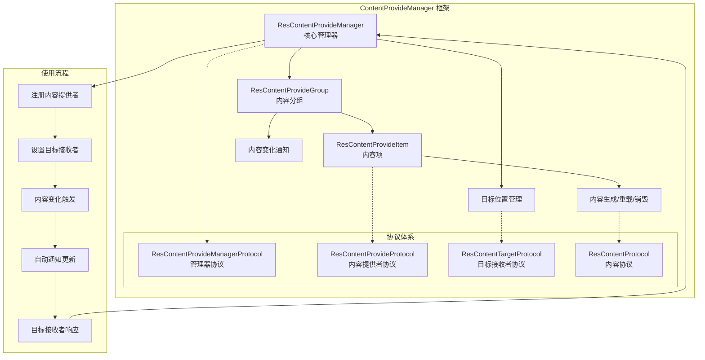

# ContentProvideManager

一个基于协议导向设计的内容提供管理框架，用于iOS应用中的动态内容管理和UI组件复用。提供Objective-C和Swift两种语言实现版。

## 项目概述

ContentProvideManager 是一个轻量级的内容管理框架，它通过协议定义和工厂模式，实现了内容提供者与目标接收者之间的解耦。该框架特别适用于需要动态加载和管理UI内容的场景，如新闻应用、内容展示页面等。

**新特性**: 现在提供完整的Swift版本，与Objective-C版本功能完全一致，开发者可以根据项目需求选择合适的语言版本。

## 核心架构

### 架构关系图



### 设计模式
- **协议导向编程 (Protocol-Oriented Programming)**: 通过协议定义接口，实现松耦合
- **工厂模式**: 内容提供者负责创建具体的内容对象
- **观察者模式**: 目标接收者监听内容变化并自动更新

### 核心组件

#### 1. ResContentProvideManager
- **功能**: 核心管理类，负责内容提供者的注册、注销和内容分发
- **职责**: 
  - 管理目标位置与内容提供者的映射关系
  - 处理内容注册和注销
  - 触发内容刷新
  - 提供内容查询接口

#### 2. ResContentProvideGroup
- **功能**: 按目标位置分组管理内容提供项
- **职责**:
  - 维护特定目标位置下的所有内容提供项
  - 处理内容变化通知
  - 管理自动刷新机制

#### 3. ResContentProvideItem
- **功能**: 内容提供项，封装单个内容提供者的信息
- **职责**:
  - 存储内容提供者、内容ID和目标位置ID
  - 提供内容生成、重载和销毁的接口

## 协议体系

### ResContentProvideProtocol
内容提供者协议，定义了内容创建和管理的核心接口：

#### Objective-C 版本
```objc
@protocol ResContentProvideProtocol <NSObject>

// 必需方法：生成内容
- (id<ResContentProtocol>)generateContentWithItem:(ResContentProvideItem *)item prop:(id _Nullable)prop;

@optional
// 可选方法：重载内容
- (void)reloadContentWithItem:(ResContentProvideItem *)item content:(id<ResContentProtocol>)content prop:(id _Nullable)prop;

// 可选方法：销毁内容
- (void)destroyContentWithItem:(ResContentProvideItem *)item content:(id<ResContentProtocol>)content prop:(id _Nullable)prop;

@end
```

#### Swift 版本
```swift
protocol ResContentProvideProtocol: AnyObject {
    
    // 必需方法：生成内容
    func generateContent(with item: ResContentProvideItem, prop: Any?) -> ResContentProtocol
    
    // 可选方法：重载内容
    func reloadContent(with item: ResContentProvideItem, content: ResContentProtocol, prop: Any?)
    
    // 可选方法：销毁内容
    func destroyContent(with item: ResContentProvideItem, content: ResContentProtocol, prop: Any?)
}

// 提供默认实现
extension ResContentProvideProtocol {
    func reloadContent(with item: ResContentProvideItem, content: ResContentProtocol, prop: Any?) {}
    func destroyContent(with item: ResContentProvideItem, content: ResContentProtocol, prop: Any?) {}
}
```

### ResContentTargetProtocol
目标接收者协议，定义了内容变化的响应接口：

#### Objective-C 版本
```objc
@protocol ResContentTargetProtocol <NSObject>

// 必需方法：处理内容变化
- (void)provideItems:(NSDictionary<NSString *, ResContentProvideItem *> *)items 
    changeForContentIds:(NSSet<NSString *> *)contentIds 
    toTargetId:(NSString *)targetId;

@optional
// 可选方法：控制是否自动响应变化
- (BOOL)shouldAutoChangeForContentIds:(NSSet<NSString *> *)contentIds toTargetId:(NSString *)targetId;

@end
```

#### Swift 版本
```swift
protocol ResContentTargetProtocol: AnyObject {
    
    // 必需方法：处理内容变化
    func provideItems(_ items: [String: ResContentProvideItem], 
                     changeForContentIds contentIds: Set<String>, 
                     toTargetId targetId: String)
    
    // 可选方法：控制是否自动响应变化
    func shouldAutoChange(forContentIds contentIds: Set<String>, toTargetId targetId: String) -> Bool
}

// 提供默认实现
extension ResContentTargetProtocol {
    func shouldAutoChange(forContentIds contentIds: Set<String>, toTargetId targetId: String) -> Bool {
        return true
    }
}
```

### ResContentProvideManagerProtocol
管理器协议，定义了内容管理的核心操作：

#### Objective-C 版本
```objc
@protocol ResContentProvideManagerProtocol <NSObject>

// 注册内容提供者
- (BOOL)registerProvide:(id<ResContentProvideProtocol>)provide 
    forContentId:(NSString *)contentId 
    toTargetId:(NSString *)targetId;

// 注销内容提供者
- (BOOL)unregisterProvideForContentId:(NSString *)contentId 
    toTargetId:(NSString *)targetId;

// 获取内容提供者
- (id<ResContentProvideProtocol>)provideForContentId:(NSString *)contentId 
    toTargetId:(NSString *)targetId;

// 获取目标位置的所有内容项
- (NSDictionary<NSString *, ResContentProvideItem *> *)provideItemsWithTargetId:(NSString *)targetId;

// 刷新目标位置的内容
- (void)reloadProvideToTargetId:(NSString *)targetId;

// 设置目标接收者
- (void)setTarget:(id<ResContentTargetProtocol>)target forId:(NSString *)targetId;

@end
```

#### Swift 版本
```swift
protocol ResContentProvideManagerProtocol: AnyObject {
    
    // 注册内容提供者
    func registerProvide(_ provide: ResContentProvideProtocol, 
                        forContentId contentId: String, 
                        toTargetId targetId: String) -> Bool
    
    // 注销内容提供者
    func unregisterProvide(forContentId contentId: String, 
                          toTargetId targetId: String) -> Bool
    
    // 获取内容提供者
    func provide(forContentId contentId: String, 
                toTargetId targetId: String) -> ResContentProvideProtocol?
    
    // 获取目标位置的所有内容项
    func provideItems(withTargetId targetId: String) -> [String: ResContentProvideItem]
    
    // 刷新目标位置的内容
    func reloadProvide(toTargetId targetId: String)
    
    // 设置目标接收者
    func setTarget(_ target: ResContentTargetProtocol, forId targetId: String)
}
```

## 使用方法

### Objective-C 版本

#### 1. 创建内容提供者

```objc
@interface MyContentProvider : NSObject <ResContentProvideProtocol>
@end

@implementation MyContentProvider

- (id<ResContentProtocol>)generateContentWithItem:(ResContentProvideItem *)item prop:(id)prop {
    // 根据item和prop创建具体的内容对象
    UIView *contentView = [[UIView alloc] init];
    // 配置contentView...
    return contentView;
}

- (void)reloadContentWithItem:(ResContentProvideItem *)item content:(id<ResContentProtocol>)content prop:(id)prop {
    // 重载内容的逻辑
}

@end
```

#### 2. 创建目标接收者

```objc
@interface MyTarget : NSObject <ResContentTargetProtocol>
@end

@implementation MyTarget

- (void)provideItems:(NSDictionary<NSString *, ResContentProvideItem *> *)items 
    changeForContentIds:(NSSet<NSString *> *)contentIds 
    toTargetId:(NSString *)targetId {
    
    // 处理内容变化
    for (NSString *contentId in contentIds) {
        ResContentProvideItem *item = items[contentId];
        if (item) {
            UIView *content = [item generateContent:nil];
            // 将content添加到UI中...
        }
    }
}

@end
```

#### 3. 使用管理器

```objc
// 创建管理器实例
ResContentProvideManager *manager = [[ResContentProvideManager alloc] init];

// 设置目标接收者
MyTarget *target = [[MyTarget alloc] init];
[manager setTarget:target forId:@"mainPage"];

// 注册内容提供者
MyContentProvider *provider = [[MyContentProvider alloc] init];
[manager registerProvide:provider forContentId:@"news" toTargetId:@"mainPage"];

// 触发内容刷新
[manager reloadProvideToTargetId:@"mainPage"];
```

### Swift 版本

#### 1. 创建内容提供者

```swift
class MyContentProvider: ResContentProvideProtocol {
    
    func generateContent(with item: ResContentProvideItem, prop: Any?) -> ResContentProtocol {
        // 根据item和prop创建具体的内容对象
        let contentView = UIView()
        // 配置contentView...
        return contentView
    }
    
    func reloadContent(with item: ResContentProvideItem, content: ResContentProtocol, prop: Any?) {
        // 重载内容的逻辑
    }
    
    func destroyContent(with item: ResContentProvideItem, content: ResContentProtocol, prop: Any?) {
        // 销毁内容的逻辑
    }
}
```

#### 2. 创建目标接收者

```swift
class MyTarget: ResContentTargetProtocol {
    
    func provideItems(_ items: [String: ResContentProvideItem], 
                     changeForContentIds contentIds: Set<String>, 
                     toTargetId targetId: String) {
        
        // 处理内容变化
        for contentId in contentIds {
            if let item = items[contentId] {
                let content = item.generateContent(prop: nil)
                // 将content添加到UI中...
            }
        }
    }
    
    func shouldAutoChange(forContentIds contentIds: Set<String>, toTargetId targetId: String) -> Bool {
        // 自定义自动响应逻辑
        return true
    }
}
```

#### 3. 使用管理器

```swift
// 创建管理器实例
let manager = ResContentProvideManager()

// 设置目标接收者
let target = MyTarget()
manager.setTarget(target, forId: "mainPage")

// 注册内容提供者
let provider = MyContentProvider()
manager.registerProvide(provider, forContentId: "news", toTargetId: "mainPage")

// 触发内容刷新
manager.reloadProvide(toTargetId: "mainPage")
```

## 特性

### 1. 自动内容管理
- 支持内容的自动创建、重载和销毁
- 智能的内容变化检测和通知机制

### 2. 灵活的内容策略
- 支持按目标位置分组管理内容
- 可扩展的内容优先级排序机制

### 3. 内存安全
- 使用弱引用避免循环引用
- 自动清理无效的内容提供者

### 4. 异步处理
- 支持延迟的内容变化通知
- 避免频繁的UI更新操作

### 5. 双语言支持
- **Objective-C**: 完整的Objective-C实现，支持所有iOS版本
- **Swift**: 现代化的Swift实现，利用Swift的协议扩展和类型安全特性

## 适用场景

- **新闻/内容应用**: 动态加载不同类型的内容模块
- **电商应用**: 灵活的商品展示和推荐内容
- **社交应用**: 动态的Feed流内容管理
- **企业应用**: 可配置的仪表板组件

## 技术特点

- **双语言支持**: 提供Objective-C和Swift两个完整版本
- **协议导向**: 高度解耦的架构设计
- **内存管理**: 合理的引用计数和弱引用使用
- **扩展性**: 易于添加新的内容类型和管理策略
- **Swift特性**: 利用协议扩展、类型安全等现代Swift特性

## 项目结构

```
ContentProvideManager/
├── Obj-C/                                  # Objective-C 版本
│   ├── ResContentProtocol.h                # 内容协议基类
│   ├── ResContentProvideProtocol.h         # 内容提供者协议
│   ├── ResContentProvideManagerProtocol.h  # 管理器协议
│   ├── ResContentProvideManager.h          # 管理器头文件
│   ├── ResContentProvideManager.m          # 管理器实现
│   ├── ResContentProvideGroup.h            # 内容组头文件
│   ├── ResContentProvideGroup.m            # 内容组实现
│   ├── ResContentProvideItem.h             # 内容项头文件
│   ├── ResContentProvideItem.m             # 内容项实现
│   └── ResContentTargetProtocol.h          # 目标接收者协议
├── Swift/                                  # Swift 版本
│   ├── ResContentProtocol.swift            # 内容协议基类
│   ├── ResContentProvideProtocol.swift     # 内容提供者协议
│   ├── ResContentProvideManagerProtocol.swift # 管理器协议
│   ├── ResContentProvideManager.swift      # 管理器实现
│   ├── ResContentProvideGroup.swift        # 内容组实现
│   ├── ResContentProvideItem.swift         # 内容项实现
│   └── ResContentTargetProtocol.swift      # 目标接收者协议
└── README.md                               # 项目说明文档
```

## 版本选择建议

- **选择Objective-C版本**:
  - 项目主要使用Objective-C开发
  - 需要支持iOS 8.0以下版本
  - 团队更熟悉Objective-C语法

- **选择Swift版本**:
  - 项目主要使用Swift开发
  - 需要利用Swift的现代特性
  - 追求更好的类型安全和代码可读性

