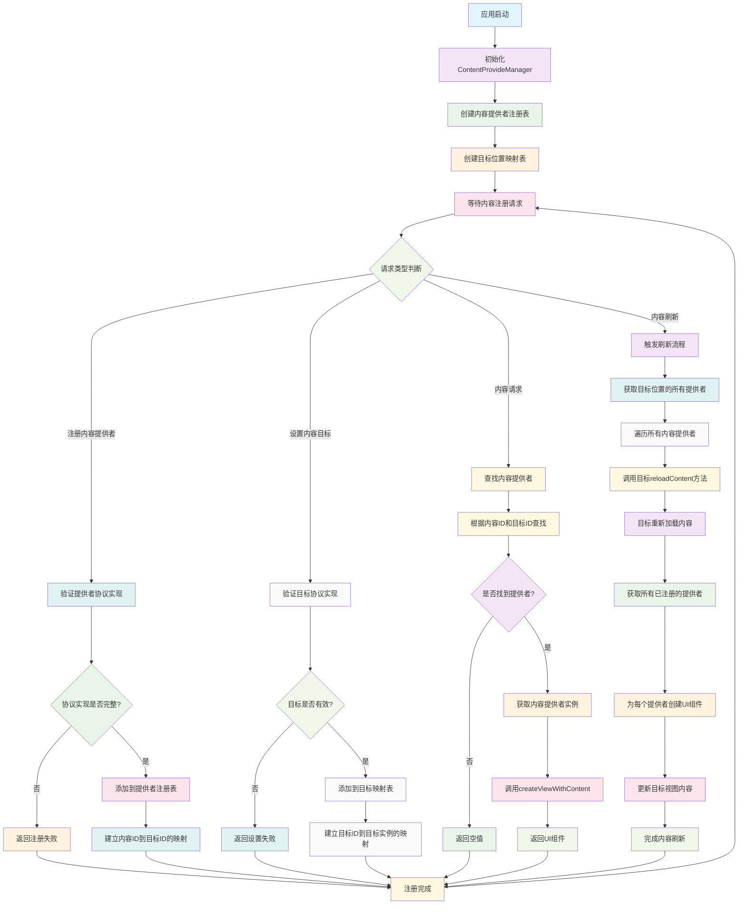

# ContentProvideManager

一个基于协议导向设计的内容提供管理框架，用于iOS应用中的动态内容管理和UI组件复用。提供Objective-C和Swift两种语言实现版本。

## 功能特性

- **协议导向设计**: 基于协议定义内容提供和接收接口，支持灵活的内容管理
- **动态内容注册**: 支持运行时注册和注销内容提供者
- **多目标支持**: 一个内容可以注册到多个目标位置
- **自动刷新机制**: 支持内容变更时的自动UI刷新
- **内存安全**: 使用弱引用避免循环引用，支持ARC内存管理
- **跨语言支持**: 提供Objective-C和Swift两种实现版本

## 工作原理流程图



## 技术实现

### 核心架构
- **协议分离**: 通过`ResContentProvideProtocol`、`ResContentTargetProtocol`等协议分离关注点
- **管理器模式**: 使用`ResContentProvideManager`统一管理内容提供者
- **观察者模式**: 通过KVO和通知机制实现内容变更监听
- **工厂模式**: 支持动态创建和管理内容提供者实例

### 实现原理

#### 内容提供机制
- **内容提供者**: 实现`ResContentProvideProtocol`协议，负责创建和管理UI组件
- **内容目标**: 实现`ResContentTargetProtocol`协议，负责接收和显示内容
- **内容管理器**: 协调内容提供者和目标之间的交互

#### 注册管理流程
1. 内容提供者注册到管理器
2. 管理器建立内容ID和目标ID的映射关系
3. 目标位置请求内容时，管理器返回对应的提供者
4. 内容变更时，管理器通知相关目标进行刷新

## 使用示例

### 基础使用
```objc
// 创建内容管理器
ResContentProvideManager *manager = [[ResContentProvideManager alloc] init];

// 设置内容目标
MyContentView *targetView = [[MyContentView alloc] init];
[manager setTarget:targetView forId:@"main_content"];

// 注册内容提供者
MyContentProvider *provider = [[MyContentProvider alloc] init];
[manager registerProvide:provider forContentId:@"news_list" toTargetId:@"main_content"];

// 获取内容提供者
id<ResContentProvideProtocol> provider = [manager provideForContentId:@"news_list" toTargetId:@"main_content"];

// 刷新内容
[manager reloadProvideToTargetId:@"main_content"];
```

### 自定义内容提供者
```objc
@interface MyContentProvider : NSObject <ResContentProvideProtocol>
@end

@implementation MyContentProvider

- (UIView *)createViewWithContent:(id)content {
    // 根据内容创建对应的UI组件
    UILabel *label = [[UILabel alloc] init];
    label.text = [content objectForKey:@"title"];
    return label;
}

- (void)updateView:(UIView *)view withContent:(id)content {
    // 更新现有UI组件的内容
    if ([view isKindOfClass:[UILabel class]]) {
        UILabel *label = (UILabel *)view;
        label.text = [content objectForKey:@"title"];
    }
}

@end
```

### 自定义内容目标
```objc
@interface MyContentView : UIView <ResContentTargetProtocol>
@end

@implementation MyContentView

- (void)reloadContent {
    // 重新加载内容
    [self.subviews makeObjectsPerformSelector:@selector(removeFromSuperview)];
    
    // 获取所有已注册的内容提供者
    NSDictionary *providers = [self.contentManager provideItemsWithTargetId:self.targetId];
    
    for (NSString *contentId in providers) {
        id<ResContentProvideProtocol> provider = providers[contentId];
        UIView *contentView = [provider createViewWithContent:self.contentData[contentId]];
        [self addSubview:contentView];
    }
}

@end
```

## 核心API

### 内容管理器接口
- `registerProvide:forContentId:toTargetId:`: 注册内容提供者
- `unregisterProvideForContentId:toTargetId:`: 注销内容提供者
- `provideForContentId:toTargetId:`: 获取指定内容提供者
- `provideItemsWithTargetId:`: 获取目标位置的所有内容提供者
- `reloadProvideToTargetId:`: 刷新目标位置的内容
- `setTarget:forId:`: 设置内容目标

### 内容提供者协议
- `createViewWithContent:`: 创建UI组件
- `updateView:withContent:`: 更新UI组件内容
- `viewClass`: 返回UI组件类名（可选）

### 内容目标协议
- `reloadContent`: 重新加载内容
- `contentManager`: 内容管理器引用
- `targetId`: 目标位置标识

## 架构优势

- **解耦合**: 内容提供者和目标位置完全解耦，便于独立开发和测试
- **可扩展**: 支持动态添加和移除内容提供者，无需修改现有代码
- **可复用**: 内容提供者可以在多个目标位置复用
- **类型安全**: 通过协议定义明确的接口契约
- **性能优化**: 延迟创建UI组件，按需加载内容

## 适用场景

- **动态内容展示**: 新闻列表、商品展示等动态内容管理
- **模块化UI**: 支持动态添加和移除UI模块
- **A/B测试**: 动态切换不同的内容提供者
- **插件系统**: 支持第三方内容提供者扩展
- **多语言支持**: 根据语言设置动态切换内容提供者

## 系统要求

- iOS 8.0+
- Xcode 8.0+
- ARC支持

## 许可证

Copyright © 2023 YLCHUN. All rights reserved.

