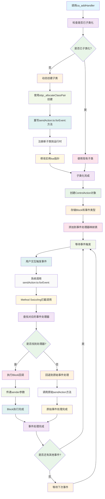

# ControlHandler

UIControl事件处理的扩展工具，提供基于Block的事件绑定机制，支持动态子类化和自动内存管理。

## 功能特性

- **Block事件绑定**: 使用Block替代传统的Target-Action模式，代码更简洁
- **动态子类化**: 运行时动态创建子类，无需手动继承UIControl
- **自动内存管理**: 自动管理Block的内存，避免循环引用
- **事件覆盖**: 支持重写sendAction:to:forEvent:方法，实现自定义事件处理
- **多事件支持**: 支持多种UIControlEvents类型的事件绑定
- **事件取消**: 支持动态移除已绑定的事件处理器

## 工作原理流程图



## 技术实现

### 核心架构
- **Method Swizzling**: 使用运行时方法交换技术重写UIControl的事件处理
- **动态子类化**: 通过objc_allocateClassPair动态创建子类
- **Block管理**: 使用NSMapTable管理Block引用，支持弱引用
- **事件拦截**: 拦截UIControl的sendAction:to:forEvent:调用

### 实现原理

#### 动态子类化机制
1. 检测当前UIControl实例是否已经子类化
2. 如果未子类化，动态创建新的子类
3. 将当前实例的isa指针指向新创建的子类
4. 在新子类中重写事件处理方法

#### Block事件管理
- 使用NSMapTable存储事件处理器，支持弱引用
- 每个ControlAction包含Block和事件类型信息
- 自动管理Block的内存，避免循环引用
- 支持动态添加和移除事件处理器

#### 事件处理流程
1. 拦截UIControl的sendAction:to:forEvent:调用
2. 查找对应的Block事件处理器
3. 执行Block回调，传递sender参数
4. 如果Block执行失败，回退到原始的事件处理

## 使用示例

### 基础事件绑定
```objc
// 创建按钮
UIButton *button = [UIButton buttonWithType:UIButtonTypeSystem];

// 绑定点击事件
ControlAction *action = [button ca_addHandler:^(UIButton *sender) {
    NSLog(@"按钮被点击: %@", sender.titleLabel.text);
} forControlEvents:UIControlEventTouchUpInside];

// 绑定多个事件
[button ca_addHandler:^(UIButton *sender) {
    NSLog(@"按钮按下");
} forControlEvents:UIControlEventTouchDown];

[button ca_addHandler:^(UIButton *sender) {
    NSLog(@"按钮抬起");
} forControlEvents:UIControlEventTouchUpOutside];
```

### 自定义事件处理
```objc
@interface CustomButton : UIButton
@end

@implementation CustomButton

- (BOOL)ca_handlerPrepare {
    // 在注册KVO之前执行，返回YES表示准备成功
    return [super ca_handlerPrepare];
}

- (BOOL)ca_sendActionOverwrite {
    // 重写sendAction:to:forEvent:方法
    return YES;
}

- (BOOL)ca_sendControlAction:(SEL)action to:(id)target forEvent:(UIEvent *)event {
    // 自定义事件处理逻辑
    if ([self shouldHandleEvent:event]) {
        // 执行自定义逻辑
        [self performCustomAction];
        return YES;
    }
    
    // 回退到原始处理
    return [super ca_sendControlAction:action to:target forEvent:event];
}

@end
```

### 事件处理器管理
```objc
// 获取已绑定的事件处理器
ControlAction *action = [button ca_addHandler:^(UIButton *sender) {
    NSLog(@"事件处理");
} forControlEvents:UIControlEventTouchUpInside];

// 移除特定事件处理器
[button ca_removeHandler:action forControlEvents:UIControlEventTouchUpInside];

// 移除所有事件处理器
[button ca_cancelPreviousPerformRequests];
```

### 复杂事件处理
```objc
// 创建滑块
UISlider *slider = [[UISlider alloc] init];

// 绑定值变化事件
[slider ca_addHandler:^(UISlider *sender) {
    CGFloat value = sender.value;
    
    // 根据值执行不同逻辑
    if (value < 0.3) {
        [self showLowValueIndicator];
    } else if (value > 0.7) {
        [self showHighValueIndicator];
    } else {
        [self hideValueIndicator];
    }
    
    // 更新UI
    [self updateProgressView:value];
} forControlEvents:UIControlEventValueChanged];

// 绑定拖拽开始事件
[slider ca_addHandler:^(UISlider *sender) {
    [self showDragIndicator];
} forControlEvents:UIControlEventTouchDown];

// 绑定拖拽结束事件
[slider ca_addHandler:^(UISlider *sender) {
    [self hideDragIndicator];
    [self saveCurrentValue:sender.value];
} forControlEvents:UIControlEventTouchUpInside];
```

## 核心API

### 事件绑定接口
- `ca_addHandler:forControlEvents:`: 添加Block事件处理器
- `ca_removeHandler:forControlEvents:`: 移除Block事件处理器
- `ca_cancelPreviousPerformRequests`: 取消所有事件处理器

### 事件处理控制
- `ca_handlerPrepare`: 事件准备，在注册KVO之前执行
- `ca_sendActionOverwrite`: 是否重写sendAction:to:forEvent:方法
- `ca_sendControlAction:to:forEvent:`: 手动触发ControlAction

### ControlAction类
- `handler`: 事件处理Block
- `controlEvents`: 绑定的事件类型
- `target`: 目标对象引用

## 技术优势

- **代码简洁**: Block语法比Target-Action更直观易读
- **内存安全**: 自动管理Block引用，避免内存泄漏
- **动态性**: 运行时动态添加和移除事件处理器
- **向后兼容**: 不影响原有的Target-Action机制
- **性能优化**: 使用Method Swizzling，性能开销最小

## 适用场景

- **快速原型**: 快速绑定UI控件事件，无需创建Target类
- **动态UI**: 运行时动态添加和移除事件处理器
- **复杂交互**: 需要多个事件类型组合的复杂交互逻辑
- **事件拦截**: 需要拦截和自定义UIControl事件处理
- **代码重构**: 将传统的Target-Action重构为Block形式

## 注意事项

- 需要在事件绑定前调用`ca_handlerPrepare`
- 动态子类化会修改对象的isa指针
- 避免在Block中强引用self，防止循环引用
- 事件处理器会在对象dealloc时自动清理

## 系统要求

- iOS 8.0+
- Xcode 8.0+
- ARC支持

## 许可证

Copyright © 2022 YLCHUN. All rights reserved.
