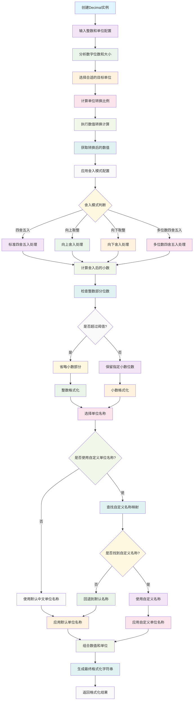

# Decimal

数字单位转换和格式化工具，支持中文单位显示、多种舍入模式和灵活的小数位数控制。提供Objective-C和Swift两种语言实现版本。

## 功能特性

- **智能单位转换**: 自动识别数字大小并转换为合适的中文单位（个、十、百、千、万、亿）
- **多种舍入模式**: 支持四舍五入、向上取整、向下取整等多种舍入策略
- **灵活小数控制**: 可配置小数位数和整数部分位数阈值
- **中文单位支持**: 内置中文单位名称，支持自定义单位名称映射
- **高性能计算**: 基于整数运算，避免浮点数精度问题
- **跨语言支持**: 提供Objective-C和Swift两种实现版本

## 工作原理流程图



## 技术实现

### 核心架构
- **单位枚举系统**: 使用位运算定义数字单位，支持组合单位
- **舍入模式枚举**: 定义多种舍入策略，满足不同业务需求
- **配置结构体**: 使用C结构体封装配置参数，提升性能
- **单位名称映射**: 支持中英文单位名称的自定义配置

### 实现原理

#### 单位转换算法
1. 分析输入数字的位数和大小
2. 根据配置的单位范围选择合适的单位
3. 计算单位转换后的数值
4. 应用舍入规则处理小数部分
5. 格式化输出字符串

#### 舍入模式实现
- **四舍五入**: 根据小数位数进行标准四舍五入
- **向上取整**: 始终向上舍入到指定小数位数
- **向下取整**: 始终向下舍入到指定小数位数
- **多位数四舍五入**: 支持不同小数位数的四舍五入

#### 小数位数控制
- 可配置保留的小数位数
- 支持整数部分位数阈值控制
- 当整数部分位数超过阈值时，自动省略小数部分

## 使用示例

### 基础单位转换
```objc
// 创建Decimal实例
Decimal *decimal = [[Decimal alloc] initWithInteger:1234567 units:DigitalUnitsBigNumber];

// 基础格式化
DecimalOpt opt = DecimalOptMake(2, DigitalRoundPlain, 4);
NSString *result = [decimal toStringWithOpt:opt];
// 输出: "123.46万"

// 自定义单位名称
NSDictionary *customNames = @{
    @(DigitalUnits1000): @"K",
    @(DigitalUnits10000): @"W",
    @(DigitalUnits100000000): @"B"
};
NSString *customResult = [decimal toStringWithOpt:opt unitNames:customNames];
// 输出: "123.46W"
```

### 不同舍入模式
```objc
// 四舍五入（默认）
DecimalOpt roundPlain = DecimalOptMake(2, DigitalRoundPlain, 4);
NSString *plain = [decimal toStringWithOpt:roundPlain];

// 向上取整
DecimalOpt roundUp = DecimalOptMake(2, DigitalRoundUp, 4);
NSString *up = [decimal toStringWithOpt:roundUp];

// 向下取整
DecimalOpt roundDown = DecimalOptMake(2, DigitalRoundDown, 4);
NSString *down = [decimal toStringWithOpt:roundDown];

// 多位数四舍五入
DecimalOpt roundPlain3 = DecimalOptMake(3, DigitalRoundPlain3, 4);
NSString *plain3 = [decimal toStringWithOpt:roundPlain3];
```

### 小数位数控制
```objc
// 保留1位小数
DecimalOpt opt1 = DecimalOptMake(1, DigitalRoundPlain, 4);
NSString *result1 = [decimal toStringWithOpt:opt1];

// 保留3位小数
DecimalOpt opt3 = DecimalOptMake(3, DigitalRoundPlain, 4);
NSString *result3 = [decimal toStringWithOpt:opt3];

// 整数部分超过4位时省略小数
DecimalOpt optNoDecimal = DecimalOptMake(2, DigitalRoundPlain, 4);
NSString *resultNoDecimal = [decimal toStringWithOpt:optNoDecimal];
```

### 组合单位使用
```objc
// 使用组合单位
DigitalUnits combinedUnits = DigitalUnits1 | DigitalUnits10000 | DigitalUnits100000000;
Decimal *decimal = [[Decimal alloc] initWithInteger:987654321 units:combinedUnits];

// 自动选择最合适的单位
DecimalOpt opt = DecimalOptMake(2, DigitalRoundPlain, 4);
NSString *result = [decimal toStringWithOpt:opt];
// 输出: "9.88亿"
```

### Swift版本使用
```swift
// 创建Decimal实例
let decimal = Decimal(integer: 1234567, units: .bigNumber)

// 基础格式化
let opt = DecimalOpt(places: 2, mode: .plain, ipddp: 4)
let result = decimal.toString(with: opt)
// 输出: "123.46万"

// 使用自定义单位名称
let customNames: [NSNumber: String] = [
    .init(value: DigitalUnits.thousand.rawValue): "K",
    .init(value: DigitalUnits.tenThousand.rawValue): "W"
]
let customResult = decimal.toString(with: opt, unitNames: customNames)
```

## 核心API

### 初始化方法
- `initWithInteger:units:`: 通过整数和单位创建Decimal实例
- `initWithInteger:units:`: Swift版本的初始化方法

### 格式化方法
- `toStringWithOpt:`: 使用配置选项格式化输出
- `toStringWithOpt:unitNames:`: 使用自定义单位名称格式化输出

### 配置选项
- `places`: 小数保留位数
- `mode`: 舍入模式
- `ipddp`: 整数部分位数阈值

### 单位枚举
- `DigitalUnits1`: 个位
- `DigitalUnits10`: 十位
- `DigitalUnits100`: 百位
- `DigitalUnits1000`: 千位
- `DigitalUnits10000`: 万位
- `DigitalUnits100000000`: 亿位
- `DigitalUnitsBigNumber`: 大数字组合单位

## 性能特点

- **整数运算**: 基于整数运算，避免浮点数精度问题
- **位操作优化**: 使用位运算进行单位组合和判断
- **内存友好**: 结构体传值，避免对象创建开销
- **缓存优化**: 单位名称映射支持缓存机制

## 适用场景

- **数据展示**: 大数字的友好显示（如用户数、金额等）
- **统计报表**: 数字统计结果的格式化输出
- **金融应用**: 金额、数量等数值的单位转换
- **游戏开发**: 分数、金币等数值的显示优化
- **数据分析**: 大数据量的单位标准化处理

## 系统要求

- iOS 8.0+
- Xcode 8.0+
- ARC支持

## 许可证

Copyright © 2024 YLCHUN. All rights reserved.
