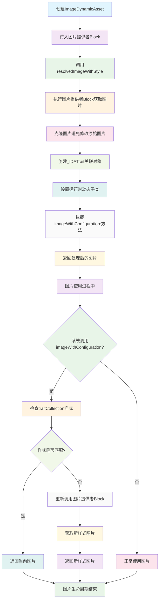

# DynamicImage

一个iOS动态图片处理组件，支持深色模式自动切换和运行时图片动态生成。

## 功能特性

- **深色模式支持**: 根据UIUserInterfaceStyle自动切换图片资源
- **动态图片生成**: 支持运行时动态创建和修改图片
- **图片克隆**: 提供图片克隆功能，避免修改原始图片
- **动态资源检测**: 自动识别动态图片资源类型
- **原始图片提取**: 从动态图片中提取原始图片数据
- **iOS 13+兼容**: 充分利用iOS 13的新特性

## 工作原理流程图



## 技术实现

### 核心架构
- **图片提供者模式**: 使用Block闭包作为图片提供者，支持动态生成
- **运行时动态子类**: 通过Runtime创建动态子类，拦截关键方法调用
- **图片克隆机制**: 使用Core Graphics创建图片副本，避免修改原始图片
- **关联对象存储**: 通过Associated Objects存储图片的元数据信息
- **方法拦截**: 拦截UIImage的关键方法，实现动态样式切换

### 实现原理

#### 动态图片机制
1. 创建ImageDynamicAsset实例，传入图片提供者Block
2. 调用resolvedImageWithStyle获取指定样式的图片
3. 如果指定样式没有图片，自动尝试其他样式作为兜底
4. 图片被克隆并设置运行时动态子类
5. 动态子类拦截imageWithConfiguration:等方法调用
6. 当系统需要不同样式图片时，通过拦截的方法重新获取

#### 运行时动态子类创建
- 使用objc_allocateClassPair创建动态子类
- 拦截imageWithConfiguration:方法，检查traitCollection样式
- 拦截resizableImageWithCapInsets:方法，支持可拉伸图片
- 通过object_setClass设置图片的isa指针

#### 深色模式适配
- 监听UIUserInterfaceStyle变化
- 根据当前样式自动选择对应图片
- 支持light、dark、unspecified三种样式
- 智能兜底机制，确保图片显示

#### 图片克隆技术
- 使用imageWithBaselineOffsetFromBottom创建图片副本
- 保持原始图片的尺寸和质量
- 支持动画图片的克隆
- 避免修改原始图片资源

## 使用示例

### 基础深色模式支持
```objc
// 创建动态图片资源
ImageDynamicAsset *asset = [ImageDynamicAsset assetWithImageProvider:^UIImage * _Nullable(UIUserInterfaceStyle style) {
    switch (style) {
        case UIUserInterfaceStyleLight:
            return [UIImage imageNamed:@"icon_light"];
        case UIUserInterfaceStyleDark:
            return [UIImage imageNamed:@"icon_dark"];
        default:
            return [UIImage imageNamed:@"icon_default"];
    }
}];

// 使用动态图片
UIImageView *imageView = [[UIImageView alloc] init];
imageView.image = [asset resolvedImageWithStyle:UIUserInterfaceStyleUnspecified];
```

### 运行时图片生成
```objc
// 动态生成渐变图片
ImageDynamicAsset *gradientAsset = [ImageDynamicAsset assetWithImageProvider:^UIImage * _Nullable(UIUserInterfaceStyle style) {
    // 根据样式生成不同颜色的渐变
    UIColor *startColor, *endColor;
    
    if (style == UIUserInterfaceStyleDark) {
        startColor = [UIColor colorWithRed:0.2 green:0.2 blue:0.2 alpha:1.0];
        endColor = [UIColor colorWithRed:0.8 green:0.8 blue:0.8 alpha:1.0];
    } else {
        startColor = [UIColor colorWithRed:0.9 green:0.9 blue:0.9 alpha:1.0];
        endColor = [UIColor colorWithRed:0.1 green:0.1 blue:0.1 alpha:1.0];
    }
    
    return [self createGradientImageWithStartColor:startColor endColor:endColor size:CGSizeMake(100, 100)];
}];
```

### 图片克隆和修改
```objc
// 克隆现有图片
UIImage *originalImage = [UIImage imageNamed:@"avatar"];
ImageDynamicAsset *asset = [[ImageDynamicAsset alloc] initWithImageProvider:^UIImage * _Nullable(UIUserInterfaceStyle style) {
    // 克隆原始图片
    UIImage *clonedImage = [ImageDynamicAsset cloneImageFromImage:originalImage];
    
    // 根据样式添加不同的滤镜效果
    if (style == UIUserInterfaceStyleDark) {
        return [self applyDarkFilter:clonedImage];
    } else {
        return [self applyLightFilter:clonedImage];
    }
}];
```

### 动态资源检测
```objc
// 检测是否为动态图片
UIImage *image = [UIImage imageNamed:@"dynamic_icon"];
if ([ImageDynamicAsset isDynamicAssetImage:image]) {
    // 提取原始图片
    UIImage *rawImage = [ImageDynamicAsset rawImageFromDynamicAssetImage:image];
    NSLog(@"这是一个动态图片资源");
} else {
    NSLog(@"这是一个普通图片资源");
}
```

### 复杂动态图片场景
```objc
// 创建复杂的动态图片系统
ImageDynamicAsset *complexAsset = [ImageDynamicAsset assetWithImageProvider:^UIImage * _Nullable(UIUserInterfaceStyle style) {
    // 根据样式、时间、用户偏好等条件生成图片
    NSDate *now = [NSDate date];
    NSCalendar *calendar = [NSCalendar currentCalendar];
    NSInteger hour = [calendar component:NSCalendarUnitHour fromDate:now];
    
    // 根据时间和样式生成不同图片
    if (style == UIUserInterfaceStyleDark) {
        if (hour >= 6 && hour < 18) {
            return [self createDarkDayImage];
        } else {
            return [self createDarkNightImage];
        }
    } else {
        if (hour >= 6 && hour < 18) {
            return [self createLightDayImage];
        } else {
            return [self createLightNightImage];
        }
    }
}];
```

## 核心API

### 初始化方法
- `initWithImageProvider:`: 通过图片提供者Block初始化
- `assetWithImageProvider:`: 便利构造方法

### 图片解析
- `resolvedImageWithStyle:`: 根据样式解析图片，支持兜底逻辑
- `imageWithStyle:`: 获取指定样式的图片
- `rawImageWithStyle:`: 执行图片提供者Block获取原始图片

### 图片克隆
- `cloneImageFromImage:`: 克隆现有图片，支持动画图片

### 动态类设置
- `setDynamicClassToImage:`: 为图片设置运行时动态子类

### 工具方法
- `isDynamicAssetImage:`: 检测是否为动态图片
- `rawImageFromDynamicAssetImage:`: 提取原始图片

### UIImage分类方法
- `imageWithDynamicProvider:`: 快速创建动态图片
- `imageWithLight:dark:`: 创建支持深色模式的图片
- `dynamicProviderRawImage:`: 获取动态图片的原始图片
- `isDynamicProviderImage:`: 检测是否为动态提供者图片

## 性能特点

- **按需生成**: 只在需要时生成图片，减少内存占用
- **图片克隆**: 避免重复创建相同图片，提升性能
- **运行时优化**: 通过动态子类实现高效的方法拦截
- **内存管理**: 自动管理图片内存，避免内存泄漏

## 适用场景

- **主题系统**: 支持深色/浅色主题切换的应用
- **动态UI**: 需要根据条件动态生成图片的界面
- **个性化**: 根据用户偏好动态调整图片样式
- **时间相关**: 根据时间、日期等条件显示不同图片
- **状态指示**: 根据应用状态动态生成状态图标

## 注意事项

- 需要iOS 13.0+支持
- 图片提供者Block会在主线程调用
- 避免在Block中执行耗时操作
- 图片克隆会创建新的图片实例，注意内存管理
- 动态子类创建是线程安全的，使用pthread_mutex保护

## 系统要求

- iOS 13.0+
- Xcode 11.0+
- ARC支持

## 许可证

Copyright © 2020 YLCHUN. All rights reserved.


