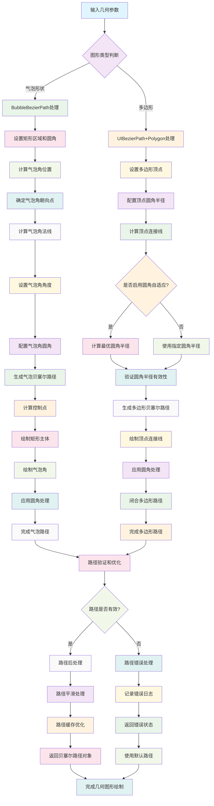

# Geometry 几何图形绘制组件

一个iOS几何图形绘制工具集合，提供气泡贝塞尔曲线和多边形贝塞尔路径的创建功能，适用于自定义UI绘制和图形设计。

## 工作原理流程图



## 组件列表

### [BubbleBezierPath](./BubbleBezierPath.h)
一个专门用于创建气泡形状贝塞尔曲线的工具类，支持自定义气泡角的位置、角度和圆角半径。

#### 主要功能
- 支持两种气泡角构建方式：基于角度和基于切线长度
- 可自定义矩形区域的圆角半径
- 支持气泡角朝向点的精确定位
- 可控制气泡角的法线高度和夹角角度
- 支持气泡角本身的圆角处理

#### 使用示例
```objc
// 创建引导气泡
CGPoint orientation = CGPointMake(115, 90);
BubbleBezierPath *path = [BubbleBezierPath bezierPathWithRect:CGRectMake(100, 200, 200, 100) 
                                                       corner:10 
                                                 orientation:orientation 
                                                       normal:10 
                                                        degree:90 
                                                        corner:0];
```

### [UIBezierPath+Polygon](./UIBezierPath+Polygon.h)
UIBezierPath的多边形扩展，支持创建带圆角的闭合多边形贝塞尔路径。

#### 主要功能
- 支持任意顶点数量的多边形创建
- 每个顶点可独立设置圆角半径
- 提供圆角半径自适应功能
- 使用PolygonVertex结构体定义顶点信息

#### 使用示例
```objc
// 创建类似专辑封面的遮罩形状
CGRect rect = CGRectMake(0, 0, 100, 100);
CGFloat minX = CGRectGetMinX(rect);
CGFloat maxX = CGRectGetMaxX(rect);
CGFloat minY = CGRectGetMinY(rect);
CGFloat maxY = CGRectGetMaxY(rect);

CGPoint lt = CGPointMake(minX, minY);
CGPoint rt = CGPointMake(maxX, minY);
CGPoint rb = CGPointMake(maxX, maxY);
CGPoint lb = CGPointMake(minX, maxY);

CGFloat rRadius = 8;
CGPoint p = CGPointMake(maxX-10, minY + (maxY-minY)/2.0);
CGPoint pt = p;
pt.x = maxX;
pt.y -= 10;

CGPoint pb = p;
pb.x = maxX;
pb.y += 10;

PolygonVertex vs[7];
vs[0] = PolygonVertextMake(lt.x, lt.y, rRadius);
vs[1] = PolygonVertextMake(rt.x, rt.y, rRadius);
vs[2] = PolygonVertextMake(pt.x, pt.y, rRadius);
vs[3] = PolygonVertextMake(p.x, p.y, rRadius);
vs[4] = PolygonVertextMake(pb.x, pb.y, rRadius);
vs[5] = PolygonVertextMake(rb.x, rb.y, rRadius);
vs[6] = PolygonVertextMake(lb.x, lb.y, rRadius);

UIBezierPath *path = [UIBezierPath bezierPathWithPolygonVertexs:vs count:7 cornerAdaption:YES];
```

## 安装使用

将Geometry文件夹添加到你的iOS项目中，确保包含所有.h和.m文件。

## 系统要求

- iOS 8.0+
- Xcode 8.0+
- Objective-C

## 许可证

Copyright © 2024 YLCHUN/Cityu. All rights reserved.
