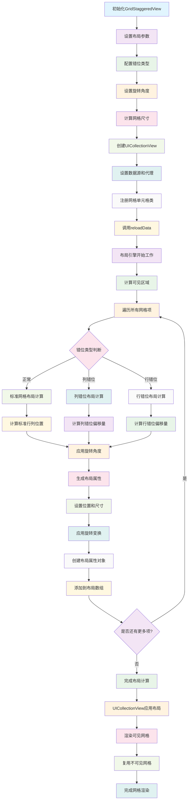

# GridStaggered

一个功能完善iOS网格交错布局组件，支持多种错位类型、旋转角度和自定义布局参数，适用于创建独特的网格视觉效果。

## 功能特性

- **多种错位类型**：支持正常、列错位、行错位三种布局模式
- **旋转支持**：可设置整体网格的旋转角度
- **灵活配置**：支持自定义间距、尺寸和错位偏移量
- **高性能**：基于 UICollectionView 实现，支持大量元素的高效渲染
- **易于使用**：简单的API接口，支持数据绑定回调

## 工作原理流程图



## 核心组件

### GridStaggeredView
主要的视图组件，继承自 UIView，内部使用 UICollectionView 实现网格布局。

### GridStaggeredLayout
布局计算核心，负责生成每个网格元素的位置、尺寸和旋转角度等属性。

### GridStaggeredLayoutAttributes
布局属性对象，包含每个网格的位置、尺寸和旋转信息。

## 使用方法

### 基本使用

```objc
// 创建视图
GridStaggeredView *staggeredView = [[GridStaggeredView alloc] initWithFrame:self.view.bounds];

// 设置网格类型和数据绑定
[staggeredView setGridClass:[UICollectionViewCell class] dataBinding:^(UIView *grid, NSUInteger index) {
    // 配置每个网格的内容
    grid.backgroundColor = [UIColor colorWithHue:index * 0.1 saturation:0.8 brightness:0.8 alpha:1.0];
}];

// 配置布局参数
GridStaggeredLayout *layout = staggeredView.layout;
layout.itemSize = CGSizeMake(60, 60);
layout.itemSpacing = 10;
layout.lineSpacing = 10;
layout.angle = 15; // 15度旋转
layout.staggerOffset = 20; // 错位偏移量
layout.staggeredType = GridStaggeredTypeColumn; // 列错位

// 添加到父视图
[self.view addSubview:staggeredView];

// 重新加载数据
[staggeredView reloadData];
```

### 布局参数说明

- `itemSize`: 网格元素尺寸
- `itemSpacing`: 网格元素之间的水平间距
- `lineSpacing`: 网格行之间的垂直间距
- `angle`: 整体网格的旋转角度（度）
- `staggerOffset`: 错位偏移量
- `staggeredType`: 错位类型
  - `GridStaggeredTypeNormal`: 正常网格
  - `GridStaggeredTypeColumn`: 列错位
  - `GridStaggeredTypeRow`: 行错位

## 错位类型效果

### 正常网格 (GridStaggeredTypeNormal)
标准的网格布局，所有元素按行列整齐排列。

### 列错位 (GridStaggeredTypeColumn)
相邻列之间产生垂直错位，创建波浪般的视觉效果。

### 行错位 (GridStaggeredTypeRow)
相邻行之间产生水平错位，创建锯齿状的视觉效果。

## 性能优化

- 使用 UICollectionView 的复用机制，支持大量元素的高效渲染
- 智能的可见区域计算，只渲染可见的网格元素
- 自动布局更新，支持动态尺寸变化

## 系统要求

- iOS 9.0+
- Xcode 10.0+
- Objective-C

## 许可证

Copyright © 2024 YLCHUN/Cityu. All rights reserved.
