# InputPrompt

一个用于 iOS 文本输入长度监控和截断的 Objective-C 库，支持实时长度提示、自动截断和自定义回调。

## 功能特性

### 核心功能
- **实时长度监控**: 监听文本输入变化，实时计算当前文本长度
- **预警提示**: 当文本长度达到预设阈值时触发回调
- **自动截断**: 支持超过最大长度时自动截断文本
- **换行符处理**: 可选择忽略换行符进行长度计算
- **前缀忽略**: 支持忽略指定前缀长度，只计算有效内容长度

### 扩展功能
- **YYTextView 支持**: 专门针对 YYTextView 的增强版本，支持富文本和文本绑定
- **智能截断**: 在 YYTextView 中保持文本绑定的完整性
- **UI 组件**: 提供 PromptLabel 组件，自动显示字数统计和状态提示

## 工作原理流程图

```mermaid
flowchart TD
    A[初始化InputPrompt] --> B[设置配置参数]
    B --> C[配置promptLength和截断选项]
    C --> D[设置输入源和通知名称]
    
    D --> E[注册NSNotificationCenter监听]
    E --> F[等待文本变化通知]
    
    F --> G[收到UITextViewTextDidChangeNotification]
    G --> H[获取当前文本内容]
    
    H --> I[文本预处理]
    I --> J{是否忽略换行符?}
    
    J -->|是| K[过滤换行符]
    J -->|否| L[保持原始文本]
    
    K --> M[计算文本长度]
    L --> M
    
    M --> N{是否忽略前缀长度?}
    N -->|是| O[减去前缀长度]
    N -->|否| P[使用完整长度]
    
    O --> Q[得到有效内容长度]
    P --> Q
    
    Q --> R{长度是否超过预警值?}
    R -->|是| S[触发预警回调]
    R -->|否| T[正常长度显示]
    
    S --> U[调用promptLengthNeededCallback]
    T --> V[更新UI显示]
    
    U --> W{是否启用自动截断?}
    W -->|是| X[执行截断逻辑]
    W -->|否| Y[仅显示预警]
    
    X --> Z[计算截断位置]
    Z --> AA[应用截断操作]
    
    AA --> BB[更新输入框文本]
    BB --> CC[触发截断完成回调]
    
    Y --> DD[显示预警提示]
    CC --> EE[更新截断状态]
    
    V --> FF[更新PromptLabel显示]
    DD --> FF
    EE --> FF
    
    FF --> GG[检查是否需要Toast提示]
    GG --> HH{是否显示Toast?}
    
    HH -->|是| II[显示Toast消息]
    HH -->|否| JJ[完成本次处理]
    
    II --> KK[Toast显示完成]
    JJ --> LL[等待下次文本变化]
    KK --> LL
    
    LL --> F
    
    style A fill:#e1f5fe
    style B fill:#f3e5f5
    style C fill:#e8f5e8
    style D fill:#fff3e0
    style E fill:#fce4ec
    style F fill:#f1f8e9
    style G fill:#e0f2f1
    style H fill:#fafafa
    style I fill:#fff8e1
    style J fill:#f3e5f5
    style K fill:#e8f5e8
    style L fill:#fff3e0
    style M fill:#fce4ec
    style N fill:#f1f8e9
    style O fill:#e0f2f1
    style P fill:#fafafa
    style Q fill:#fff8e1
    style R fill:#f3e5f5
    style S fill:#e8f5e8
    style T fill:#fff3e0
    style U fill:#fce4ec
    style V fill:#f1f8e9
    style W fill:#e0f2f1
    style X fill:#fafafa
    style Y fill:#fff8e1
    style Z fill:#f3e5f5
    style AA fill:#e8f5e8
    style BB fill:#fff3e0
    style CC fill:#fce4ec
    style DD fill:#f1f8e9
    style EE fill:#e0f2f1
    style FF fill:#fafafa
    style GG fill:#fff8e1
    style HH fill:#f3e5f5
    style II fill:#e8f5e8
    style JJ fill:#fff3e0
    style KK fill:#fce4ec
    style LL fill:#f1f8e9
```



## 实现原理

### 架构设计
```
InputPrompt (核心类)
├── 文本输入监听 (NSNotificationCenter)
├── 长度计算引擎
├── 截断逻辑处理
└── 回调机制

PromptLabel (UI 组件)
├── 实现 InputPromptProtocol
├── 自动更新显示
└── Toast 提示功能

YYInputPrompt (YYTextView 扩展)
├── 继承 InputPrompt
├── 富文本长度计算
└── 文本绑定完整性保护
```

### 核心机制

#### 1. 文本变化监听
- 通过 `NSNotificationCenter` 监听文本输入变化
- 支持自定义通知名称，兼容不同输入组件
- 智能处理预输入状态，避免重复触发

#### 2. 长度计算策略
```objc
// 基础长度计算
NSUInteger length = text.length;

// 忽略换行符
if (self.ignoreLineBreak) {
    text = [self filterLineBreak:text];
    length = text.length;
}

// 忽略前缀长度
if (self.ignorePrefixPromptLength > 0 && length >= self.ignorePrefixPromptLength) {
    length -= self.ignorePrefixPromptLength;
}
```

#### 3. 智能截断算法
- 计算截断位置时考虑换行符数量
- 在 YYTextView 中保持文本绑定的完整性
- 支持自定义截断位置调整

#### 4. 回调机制
- 支持 Block 回调：`(void(^)(InputPrompt *prompt, NSUInteger length, BOOL truncated))`
- 支持协议回调：`InputPromptProtocol`
- 实时反馈当前长度和截断状态

## 使用示例

### 基础用法

#### 1. 创建 InputPrompt 实例
```objc
InputPrompt *prompt = [[InputPrompt alloc] init];
prompt.promptLength = 100;  // 设置预警长度
prompt.truncateInput = YES; // 启用自动截断
prompt.ignoreLineBreak = YES; // 忽略换行符
```

#### 2. 设置输入源和回调
```objc
// 设置输入源
[prompt setInput:textView textDidChangeNotificationName:UITextViewTextDidChangeNotification];

// 设置长度预警回调
[prompt setPromptLength:100 neededCallback:^(InputPrompt *prompt, NSUInteger length, BOOL truncated) {
    if (truncated) {
        NSLog(@"文本已被截断");
    }
    NSLog(@"当前长度: %lu", (unsigned long)length);
}];
```

#### 3. 使用 PromptLabel 组件
```objc
PromptLabel *label = [[PromptLabel alloc] init];
label.normalColor = [UIColor grayColor];
label.markedColor = [UIColor redColor];
label.toast = @"已达到最大长度限制";

// 设置输出
prompt.output = label;
```

### 高级用法

#### 1. YYTextView 集成
```objc
YYInputPrompt *yyPrompt = [[YYInputPrompt alloc] init];
yyPrompt.promptLength = 200;
yyPrompt.truncateTextBinding = YES; // 保持文本绑定完整性

// 设置 YYTextView
[yyPrompt setInput:yyTextView];
```

#### 2. 自定义截断逻辑
```objc
@interface CustomInputPrompt : InputPrompt
@end

@implementation CustomInputPrompt

- (NSUInteger)shouldTruncateBegin:(NSUInteger)position {
    // 自定义截断位置计算逻辑
    return position - 10; // 提前 10 个字符截断
}

- (UITextRange *)shouldTruncateInput:(id<UITextInput>)input range:(UITextRange *)range {
    // 自定义截断范围
    return range;
}

@end
```

#### 3. 忽略前缀长度
```objc
InputPrompt *prompt = [[InputPrompt alloc] init];
prompt.promptLength = 100;
prompt.ignorePrefixPromptLength = 20; // 忽略前 20 个字符

// 实际计算长度 = 总长度 - 20
```

### 完整示例项目

```objc
@interface ViewController () <InputPromptProtocol>
@property (nonatomic, strong) InputPrompt *prompt;
@property (nonatomic, strong) UITextView *textView;
@property (nonatomic, strong) PromptLabel *promptLabel;
@end

@implementation ViewController

- (void)viewDidLoad {
    [super viewDidLoad];
    
    // 创建 UI 组件
    self.textView = [[UITextView alloc] initWithFrame:CGRectMake(20, 100, 300, 200)];
    self.textView.layer.borderWidth = 1;
    self.textView.layer.borderColor = [UIColor lightGrayColor].CGColor;
    [self.view addSubview:self.textView];
    
    self.promptLabel = [[PromptLabel alloc] initWithFrame:CGRectMake(20, 320, 300, 30)];
    self.promptLabel.textAlignment = NSTextAlignmentRight;
    self.promptLabel.normalColor = [UIColor grayColor];
    self.promptLabel.markedColor = [UIColor redColor];
    self.promptLabel.toast = @"已达到最大长度限制";
    [self.view addSubview:self.promptLabel];
    
    // 配置 InputPrompt
    self.prompt = [[InputPrompt alloc] init];
    self.prompt.promptLength = 100;
    self.prompt.truncateInput = YES;
    self.prompt.ignoreLineBreak = YES;
    self.prompt.output = self;
    
    // 设置输入源
    [self.prompt setInput:self.textView textDidChangeNotificationName:UITextViewTextDidChangeNotification];
}

#pragma mark - InputPromptProtocol

- (void)inputPrompt:(InputPrompt *)prompt length:(NSUInteger)length maxLength:(NSUInteger)maxLength {
    NSLog(@"文本长度: %lu/%lu", (unsigned long)length, (unsigned long)maxLength);
    
    if (length >= maxLength) {
        // 达到最大长度时的处理
        self.textView.backgroundColor = [UIColor colorWithRed:1.0 green:0.9 blue:0.9 alpha:1.0];
    } else {
        self.textView.backgroundColor = [UIColor whiteColor];
    }
}

@end
```

## 安装说明

### 手动集成
1. 将 `InputPrompt.h/m`、`PromptLabel.h/m` 文件添加到项目中
2. 如需 YYTextView 支持，同时添加 `YYInputPrompt.h/m` 文件
3. 在需要使用的文件中导入头文件

## 作者

Created by Cityu on 2022/3/31

