# InvokeMap

一个轻量级的Objective-C函数调用映射框架，支持多上下文函数注册、异步调用和优先级排序。

## 功能特性

- 🔗 **函数映射**: 支持一个函数名对应多个上下文处理器
- 🚀 **异步支持**: 支持同步和异步函数调用
- 📊 **优先级排序**: 通过协议实现调用上下文的优先级排序
- 🎯 **灵活注册**: 支持Block和Selector两种注册方式
- 💾 **内存管理**: 使用弱引用避免循环引用问题
- 🔄 **回调机制**: 支持异步回调处理

## 工作原理流程图

```mermaid
flowchart TD
    A[创建InvokeMap实例] --> B[初始化函数映射表]
    B --> C[初始化上下文映射表]
    C --> D[设置上下文排序器]
    
    D --> E[等待函数注册请求]
    E --> F{注册类型判断}
    
    F -->|Block注册| G[调用setFunc:ctx:handler:async:]
    F -->|Selector注册| H[调用setFunc:ctx:sel:async:]
    
    G --> I[验证函数名和上下文]
    H --> I
    
    I --> J{参数是否有效?}
    J -->|否| K[返回注册失败]
    J -->|是| L[创建函数处理器]
    
    L --> M[存储到函数映射表]
    M --> N[建立函数名到上下文的映射]
    N --> O[注册完成]
    
    O --> P[等待函数调用请求]
    P --> Q[调用invokeFunc:args:ctxId:async:callback:]
    
    Q --> R[查找函数名对应的上下文]
    R --> S{是否找到上下文?}
    
    S -->|否| T[返回调用失败]
    S -->|是| U[获取上下文列表]
    
    U --> V{是否设置了排序器?}
    V -->|是| W[执行上下文排序]
    V -->|否| X[使用原始顺序]
    
    W --> Y[应用排序算法]
    X --> Z[保持原始顺序]
    
    Y --> AA[获取排序后的上下文]
    Z --> AA
    
    AA --> BB[遍历所有上下文]
    BB --> CC{是否为异步调用?}
    
    CC -->|是| DD[创建异步任务队列]
    CC -->|否| EE[直接执行同步调用]
    
    DD --> FF[将任务加入队列]
    FF --> GG[异步执行处理器]
    
    EE --> HH[直接调用处理器]
    GG --> II[处理器执行完成]
    HH --> II
    
    II --> JJ[收集执行结果]
    JJ --> KK[调用回调函数]
    
    KK --> LL[完成函数调用]
    T --> MM[返回错误状态]
    
    LL --> NN[等待下次调用]
    MM --> NN
    
    NN --> P
    
    style A fill:#e1f5fe
    style B fill:#f3e5f5
    style C fill:#e8f5e8
    style D fill:#fff3e0
    style E fill:#fce4ec
    style F fill:#f1f8e9
    style G fill:#e0f2f1
    style H fill:#fafafa
    style I fill:#fff8e1
    style J fill:#f3e5f5
    style K fill:#e8f5e8
    style L fill:#fff3e0
    style M fill:#fce4ec
    style N fill:#f1f8e9
    style O fill:#e0f2f1
    style P fill:#fafafa
    style Q fill:#fff8e1
    style R fill:#f3e5f5
    style S fill:#e8f5e8
    style T fill:#fff3e0
    style U fill:#fce4ec
    style V fill:#f1f8e9
    style W fill:#e0f2f1
    style X fill:#fafafa
    style Y fill:#fff8e1
    style Z fill:#f3e5f5
    style AA fill:#e8f5e8
    style BB fill:#fff3e0
    style CC fill:#fce4ec
    style DD fill:#f1f8e9
    style EE fill:#e0f2f1
    style FF fill:#fafafa
    style GG fill:#fff8e1
    style HH fill:#f3e5f5
    style II fill:#e8f5e8
    style JJ fill:#fff3e0
    style KK fill:#fce4ec
    style LL fill:#f1f8e9
    style MM fill:#e0f2f1
    style NN fill:#fafafa
```



## 系统要求

- iOS 8.0+ / macOS 10.10+
- Xcode 8.0+
- Objective-C

## 安装

将以下文件添加到您的项目中：
- `InvokeMap.h`
- `InvokeMap.m`

## 使用方法

### 基本用法

```objc
#import "InvokeMap.h"

// 创建InvokeMap实例
InvokeMap<UIViewController *> *invokeMap = [[InvokeMap alloc] init];

// 注册函数处理器
[invokeMap setFunc:@"handleData" 
               ctx:viewController 
           handler:^(UIViewController *ctx, NSDictionary *args, InvokeMapCallback callback) {
    // 处理逻辑
    NSLog(@"处理数据: %@", args);
    callback(@{@"result": @"success"});
} 
            async:NO];

// 调用函数
[invokeMap invokeFunc:@"handleData" 
                  args:@{@"key": @"value"} 
                  ctxId:nil 
                  async:NO 
               callback:^(NSDictionary *params) {
    NSLog(@"回调结果: %@", params);
}];
```

### 使用Selector注册

```objc
// 在ViewController中实现方法
- (void)handleDataWithParam:(NSDictionary *)args callback:(InvokeMapCallback)callback {
    // 处理逻辑
    callback(@{@"status": @"completed"});
}

// 注册Selector
[invokeMap setFunc:@"handleData" 
               ctx:viewController 
               sel:@selector(handleDataWithParam:callback:) 
            async:NO];
```

### 异步调用

```objc
// 异步调用
[invokeMap invokeFunc:@"handleData" 
                  args:@{@"async": @YES} 
                  ctxId:nil 
                  async:YES 
               callback:^(NSDictionary *params) {
    dispatch_async(dispatch_get_main_queue(), ^{
        // 更新UI
        NSLog(@"异步处理完成: %@", params);
    });
}];
```

### 优先级排序

```objc
@interface MyContextSorter : NSObject <InvokeMapCtxSort>
@end

@implementation MyContextSorter

- (NSArray<InvokeMapCtxId *> *)sortCtxs:(NSArray<InvokeMapCtxId *> *)ctxs 
                                    func:(InvokeMapFuncName *)func 
                                    args:(NSDictionary *)args {
    // 实现自定义排序逻辑
    return [ctxs sortedArrayUsingComparator:^NSComparisonResult(InvokeMapCtxId *obj1, InvokeMapCtxId *obj2) {
        // 根据业务逻辑排序
        return [obj1 compare:obj2];
    }];
}

@end

// 设置排序器
MyContextSorter *sorter = [[MyContextSorter alloc] init];
invokeMap.ctxSort = sorter;
```

## API 参考

### InvokeMap 类

#### 属性

- `ctxSort`: 上下文排序器，实现 `InvokeMapCtxSort` 协议

#### 方法

##### 注册函数

```objc
// 使用Block注册
- (BOOL)setFunc:(InvokeMapFuncName *)func 
             ctx:(CtxType)ctx 
         handler:(InvokeMapHandler)handler 
            async:(BOOL)async;

// 使用Selector注册
- (BOOL)setFunc:(NSString *)func 
             ctx:(id)ctx 
             sel:(SEL)sel 
            async:(BOOL)async;
```

##### 调用函数

```objc
- (NSUInteger)invokeFunc:(InvokeMapFuncName *)func 
                    args:(NSDictionary *)args 
                    ctxId:(InvokeMapCtxId *)ctxId 
                    async:(BOOL)async 
                 callback:(InvokeMapCallback)callback;
```

##### 工具方法

```objc
+ (InvokeMapCtxId *)ctxId:(id)ctx;
```

### 类型定义

```objc
typedef NSString InvokeMapFuncName;        // 函数名类型
typedef NSString InvokeMapCtxId;          // 上下文ID类型

typedef void(^InvokeMapCallback)(NSDictionary *_Nullable args);           // 回调Block
typedef void(^InvokeMapHandler)(CtxType ctx, NSDictionary *_Nullable args, InvokeMapCallback callback); // 处理器Block
```

### InvokeMapCtxSort 协议

```objc
@protocol InvokeMapCtxSort <NSObject>

- (NSArray<InvokeMapCtxId *> *)sortCtxs:(NSArray<InvokeMapCtxId *> *)ctxs 
                                    func:(InvokeMapFuncName *)func 
                                    args:(NSDictionary *_Nullable)args;

@end
```

## 使用场景

- **模块间通信**: 实现松耦合的模块间函数调用
- **插件系统**: 支持动态注册和调用插件功能
- **事件处理**: 多处理器的事件分发系统
- **中间件**: 实现函数调用的拦截和排序

## 注意事项

1. **内存管理**: 框架使用弱引用管理上下文对象，避免循环引用
2. **线程安全**: 当前版本不支持多线程并发访问，请在主线程使用
3. **函数名**: 函数名不能为空字符串
4. **上下文对象**: 上下文对象不能为nil

## 许可证

本项目采用 MIT 许可证。

## 作者

Created by Cityu on 2023/8/31
