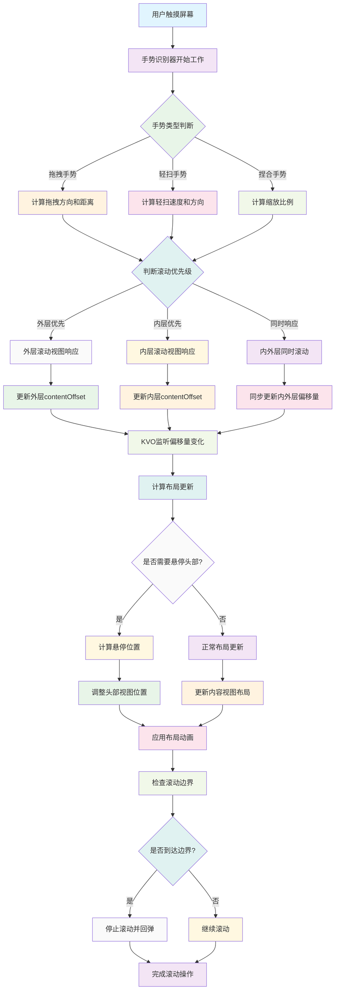

# NestedScrollView

一个高性能的iOS嵌套滚动视图解决方案，支持UIScrollView和UICollectionView的嵌套滚动，提供流畅的滚动体验和丰富的自定义选项。

## 功能特性

- 🚀 **高性能嵌套滚动** - 基于手势识别和KVO的优化实现
- 📱 **多平台支持** - 支持UIScrollView和UICollectionView
- 🎯 **智能滚动同步** - 自动处理内外层滚动视图的偏移量同步
- 🔧 **丰富的自定义选项** - 支持头部悬停、底部间距、滚动动画等
- 🛡️ **防抖动优化** - 内置多种优化机制，避免滚动过程中的抖动
- 📐 **精确的布局控制** - 支持动态内容高度调整和布局更新

## 工作原理流程图



## 安装

### 手动安装

1. 下载项目文件
2. 将以下文件添加到您的项目中：
   - `NestedScrollView.h`
   - `NestedScrollView.m`
   - `ScrollNestedCollectionView.h`
   - `ScrollNestedCollectionView.m`

### 依赖

项目依赖以下第三方库：
- [KVOController](https://github.com/facebook/KVOController) - Facebook的KVO控制器

## 使用方法

### 基础用法

#### NestedScrollView (UIScrollView版本)

```objective-c
#import "NestedScrollView.h"

// 创建嵌套滚动视图
NestedScrollView *nestedScrollView = [[NestedScrollView alloc] initWithFrame:self.view.bounds];

// 设置外层内容高度
nestedScrollView.outterContentHeight = 200;

// 设置嵌套面板视图
nestedScrollView.nestedPanelView = panelView;

// 设置嵌套滚动视图
nestedScrollView.nestedScrollView = innerScrollView;

// 设置头部视图（可选）
nestedScrollView.headerView = headerView;

// 设置悬停偏移量（可选）
nestedScrollView.stikerOffset = 50;

// 设置底部间距（可选）
nestedScrollView.bottomInset = 20;

[self.view addSubview:nestedScrollView];
```

#### ScrollNestedCollectionView (UICollectionView版本)

```objective-c
#import "ScrollNestedCollectionView.h"

// 创建嵌套面板视图
ScrollNestedPanelView *panelView = [[ScrollNestedPanelView alloc] init];
panelView.headerView = headerView;
panelView.contentView = contentView;

// 创建嵌套集合视图
UICollectionViewFlowLayout *layout = [[UICollectionViewFlowLayout alloc] init];
ScrollNestedCollectionView *collectionView = [[ScrollNestedCollectionView alloc] 
    initWithFrame:self.view.bounds 
    collectionViewLayout:layout 
    nestedPanelView:panelView];

// 设置嵌套滚动视图
collectionView.nestedScrollView = innerScrollView;

// 设置悬停偏移量
collectionView.nestedScrollInsetTopOffset = 50;

[self.view addSubview:collectionView];
```

### 高级用法

#### 滚动控制

```objective-c
// 滚动到嵌套位置
[nestedScrollView scrollToNested:YES];

// 滚动到顶部
[nestedScrollView scrollToTop:YES];

// 滚动到底部
[nestedScrollView sctollToBottom:YES];

// 停止减速滚动（如果需要）
[nestedScrollView stopDeceleratingIfNeed];
```

#### 动态内容高度

```objective-c
// 动态设置外层内容高度（带动画）
[nestedScrollView setOutterContentHeight:300 animated:YES];

// 动态设置外层内容高度（无动画）
nestedScrollView.outterContentHeight = 300;
```

#### 观察嵌套滚动视图偏移量

```objective-c
// 启用观察嵌套滚动视图的contentOffset变化
nestedScrollView.observeNestedScrollViewContentOffset = YES;
```

## 核心类说明

### NestedScrollView

继承自`UIScrollView`，提供嵌套滚动功能的主要类。

**主要属性：**
- `nestedPanelView` - 嵌套面板视图
- `nestedScrollView` - 嵌套的滚动视图
- `outterContentHeight` - 外层内容高度
- `headerView` - 头部视图
- `stikerOffset` - 悬停偏移量
- `bottomInset` - 底部间距

**主要方法：**
- `scrollToNested:` - 滚动到嵌套位置
- `scrollToTop:` - 滚动到顶部
- `sctollToBottom:` - 滚动到底部

### ScrollNestedCollectionView

继承自`UICollectionView`，专门为集合视图设计的嵌套滚动实现。

**主要属性：**
- `nestedScrollView` - 嵌套的滚动视图
- `nestedPanelView` - 嵌套面板视图
- `nestedScrollInsetTopOffset` - 悬停偏移量

### ScrollNestedPanelView

嵌套面板视图容器，用于管理头部视图和内容视图的布局。

**主要属性：**
- `headerView` - 头部视图（通常是TabBar）
- `contentView` - 内容视图（通常是滚动视图的父视图）

## 实现原理

### 手势识别

通过重写`gestureRecognizer:shouldRecognizeSimultaneouslyWithGestureRecognizer:`方法，实现内外层滚动视图的手势同时识别，确保滚动体验的流畅性。

### KVO监听

使用KVO监听嵌套滚动视图的`contentSize`、`contentInset`和`contentOffset`变化，自动同步内外层的滚动状态。

### 偏移量同步

通过`driftNested`方法实现内外层滚动视图偏移量的精确同步，避免滚动过程中的抖动和偏移。

### 布局管理

自动管理嵌套面板视图的布局，根据外层滚动视图的偏移量动态调整内层滚动视图的位置和大小。

## 注意事项

1. **视图层级**：嵌套滚动视图必须是嵌套面板视图的子视图
2. **内容高度**：正确设置`outterContentHeight`对于良好的滚动体验至关重要
3. **内存管理**：使用KVO时注意在适当时机移除观察者
4. **性能优化**：避免在滚动过程中进行耗时的UI操作

## 常见问题

### Q: 滚动时出现抖动怎么办？
A: 检查是否正确设置了`outterContentHeight`，并确保嵌套滚动视图的内容高度计算正确。

### Q: 头部视图无法悬停？
A: 设置`stikerOffset`属性，并确保头部视图正确添加到`headerView`属性中。

### Q: 嵌套滚动视图无法滚动？
A: 检查手势识别器是否正确设置，并确保`scrollEnabled`属性为`YES`。

## 许可证

Copyright © 2021 YLCHUN. All rights reserved.

## 联系方式

如有问题或建议，请通过GitHub Issues联系我们。
