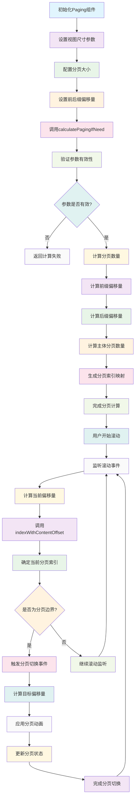

# PagingView

一个功能完善的iOS分页视图组件，提供灵活的分页计算和分页滚动视图实现，支持自定义分页大小、前后缀设置和智能分页逻辑。

## 功能特性

- **智能分页计算**: 自动计算分页索引和偏移量
- **灵活的前后缀支持**: 支持设置分页内容的前缀和后缀
- **多方向滚动**: 支持水平和垂直方向的分页滚动
- **高性能代理**: 使用代理模式优化滚动性能
- **精确的偏移计算**: 基于滑动速率和分页速度的智能偏移计算

## 工作原理流程图



## 核心组件

### Paging
分页计算的核心类，负责处理分页逻辑和索引计算。

#### 主要属性
- `viewSize`: 视图大小
- `contentSize`: 内容大小
- `pagingSize`: 分页大小
- `prefixInset`: 前缀偏移量（只读）
- `suffixInset`: 后缀偏移量（只读）

#### 核心方法
```objc
// 设置分页前后缀
- (void)setContentInsetPrefix:(CGFloat)prefix suffix:(CGFloat)suffix;

// 计算分页
- (BOOL)calculatePagingIfNeed;

// 通过索引计算内容偏移量
- (CGFloat)contentOffsetWithIndex:(PagingIndex)index;

// 通过内容偏移量计算索引
- (PagingIndex)indexWithContentOffset:(CGFloat)contentOffset;

// 计算索引偏移结果
- (PagingIndex)calculateIndex:(PagingIndex)index offset:(NSInteger)offset;

// 计算目标偏移量
- (CGFloat)targetOffsetWithCurrent:(CGFloat)currentOffset 
                      proposed:(CGFloat)proposedOffset 
              scrollingVelocity:(CGFloat)scrollingVelocity 
                 pagingVelocity:(CGFloat)pagingVelocity;
```

### PagingScrollView
继承自 UIScrollView 的分页滚动视图，支持水平和垂直方向的分页滚动。

#### 主要属性
- `pagingSize`: 分页大小
- `isHorizontalDirection`: 是否为水平方向

### PagingCollectionView
继承自 UICollectionView 的分页集合视图，专门为集合视图提供分页功能。

#### 主要属性
- `pagingSize`: 分页大小

## 使用示例

### 基本分页设置
```objc
Paging *paging = [[Paging alloc] init];
paging.viewSize = 300.0;        // 视图宽度
paging.contentSize = 1500.0;    // 内容总宽度
paging.pagingSize = 300.0;      // 每页宽度

// 设置前后缀
[paging setContentInsetPrefix:50.0 suffix:50.0];

// 计算分页
if ([paging calculatePagingIfNeed]) {
    // 分页计算成功
}
```

### 分页滚动视图使用
```objc
PagingScrollView *scrollView = [[PagingScrollView alloc] init];
scrollView.pagingSize = CGSizeMake(300, 200);
scrollView.isHorizontalDirection = YES;

// 设置代理
scrollView.delegate = self;
```

### 分页集合视图使用
```objc
PagingCollectionView *collectionView = [[PagingCollectionView alloc] init];
collectionView.pagingSize = CGSizeMake(300, 200);

// 设置布局和代理
UICollectionViewFlowLayout *layout = [[UICollectionViewFlowLayout alloc] init];
layout.itemSize = CGSizeMake(300, 200);
layout.scrollDirection = UICollectionViewScrollDirectionHorizontal;
collectionView.collectionViewLayout = layout;
```

## 分页索引类型

```objc
typedef NS_ENUM(NSInteger, PagingIndexType) {
    PagingPrefixIndex = -1,    // 前缀索引
    PagingBodyIndex = 0,       // 主体索引
    PagingSuffixIndex = 1      // 后缀索引
};

typedef struct {
    NSInteger index;           // 索引值
    PagingIndexType type;      // 索引类型
} PagingIndex;
```

## 注意事项

1. 分页大小必须大于0才能正常计算
2. 视图大小和内容大小必须大于0
3. 前后缀设置会影响分页计算逻辑
4. 使用代理模式时注意内存管理

## 系统要求

- iOS 8.0+
- Xcode 8.0+
- Objective-C

## 许可证

Copyright © 2024 YLCHUN/Cityu. All rights reserved.
