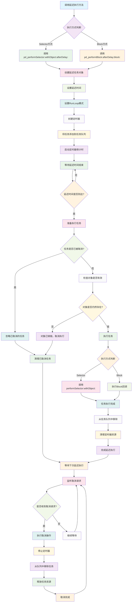

# PerformDelay

NSObject 的延迟执行扩展工具，支持 Selector 和 Block 两种方式，自动管理内存和取消操作。

## 功能特性

- 支持 Selector 和 Block 两种延迟执行方式
- 自动内存管理，延迟期间对象不会被持有
- 支持 RunLoop 模式控制
- 自动取消机制，对象销毁时自动清理
- 支持通过 key 标识的 Block 执行

## 工作原理流程图



## 主要方法

### Selector 延迟执行

```objc
- (void)pd_performSelector:(SEL)aSelector 
                withObject:(id)anArgument 
                afterDelay:(NSTimeInterval)delay;

- (void)pd_performSelector:(SEL)aSelector 
                withObject:(id)anArgument 
                afterDelay:(NSTimeInterval)delay 
                   inModes:(NSArray<NSRunLoopMode> *)modes;
```

### Block 延迟执行

```objc
- (void)pd_performBlock:(NSString *)key 
              afterDelay:(NSTimeInterval)delay 
                   block:(void(^)(id sender))block;

- (void)pd_performBlock:(NSString *)key 
              afterDelay:(NSTimeInterval)delay 
                 inModes:(NSArray<NSRunLoopMode> *)modes 
                   block:(void(^)(id sender))block;
```

### 取消操作

```objc
- (void)pd_cancelPreviousPerformRequests;
- (void)pd_cancelPreviousPerformRequestsWithSelector:(SEL)aSelector 
                                              object:(id)anArgument;
- (void)pd_cancelPreviousPerformRequestsWithBlock:(NSString *)key;
```

## 使用示例

```objc
// Selector 延迟执行
[self pd_performSelector:@selector(doSomething) 
              withObject:nil 
              afterDelay:2.0];

// Block 延迟执行
[self pd_performBlock:@"myTask" 
           afterDelay:3.0 
                block:^(id sender) {
    NSLog(@"延迟任务执行");
}];

// 取消特定任务
[self pd_cancelPreviousPerformRequestsWithBlock:@"myTask"];

// 取消所有延迟任务
[self pd_cancelPreviousPerformRequests];
```

## 核心特性

### 内存安全
- 延迟执行期间，当前对象不会被持有
- 避免循环引用和内存泄漏问题

### 自动清理
- 对象销毁时自动执行 cancel 操作
- 无需手动管理延迟任务的清理

### RunLoop 模式支持
- 支持指定 RunLoop 模式执行
- 适用于不同场景下的任务调度

## 注意事项

- 使用 Block 方式时，建议使用有意义的 key 标识
- 在对象销毁前主动取消不需要的延迟任务
- 支持嵌套调用，但要注意避免过度嵌套

## 版本信息

- 创建时间：2023年8月8日
- 作者：Cityu
