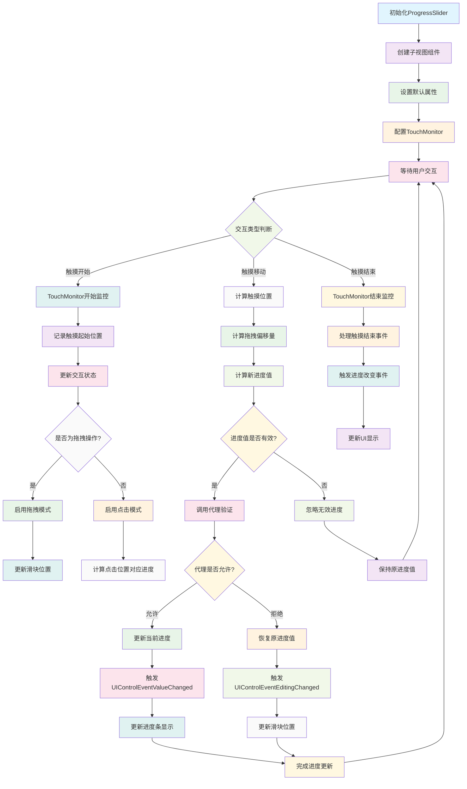

# ProgressSlider

一个功能完善的iOS进度滑块组件，支持双进度显示、拖拽交互和丰富的自定义选项。

## 功能特性

- **双进度显示**: 支持当前进度和预加载进度的同时显示
- **交互支持**: 支持拖拽和点击两种交互方式
- **自定义外观**: 可自定义进度条高度、圆角、滑块大小等
- **事件回调**: 提供丰富的UIControl事件和代理方法
- **触摸监控**: 集成TouchMonitor实现精确的触摸事件处理
- **布局灵活**: 支持自定义进度条区域和事件响应区域

## 工作原理流程图



## 主要组件

- `backgroundView`: 背景进度条视图
- `curProgressView`: 当前进度视图
- `preProgressView`: 预加载进度视图
- `dotView`: 可拖拽的滑块视图

## API 接口

### 属性

```objc
// 代理对象
@property (nonatomic, weak) id<ProgressSliderDelegate> delegate;

// 外观设置
@property (nonatomic, assign) BOOL progressRounded;        // 进度条圆角，默认YES
@property (nonatomic, assign) CGSize dotSize;              // 滑块大小，默认进度条高度*2

// 进度控制
@property (nonatomic, assign) CGFloat curProgress;          // 当前进度 (0.0-1.0)
@property (nonatomic, assign) CGFloat preProgress;          // 预加载进度 (0.0-1.0)

// 交互控制
@property (nonatomic, assign) BOOL progressDragEnabled;     // 是否允许拖拽，默认YES

// 状态查询
@property (nonatomic, readonly) BOOL tracking;              // 是否正在拖拽
@property (nonatomic, readonly) BOOL taping;                // 是否正在点击
@property (nonatomic, readonly) BOOL editing;               // 是否正在编辑
@property (nonatomic, readonly) BOOL interactingChanged;    // 是否由内部交互产生变化
@property (nonatomic, readonly) CGFloat editingTranslation; // 编辑时的偏移量
```

### 代理方法

```objc
@protocol ProgressSliderDelegate <NSObject>
@optional
// 进度改变前的验证
- (BOOL)progressSlider:(ProgressSlider *)progressSlider shouldChangeCurProgress:(CGFloat)progress;
@end
```

### 事件

- `UIControlEventValueChanged`: 进度值改变时触发
- `UIControlEventEditingChanged`: 编辑状态改变时触发

### 核心方法

```objc
// 初始化完成后的设置
- (void)didInitialize;

// 获取进度条区域
- (CGRect)progressRect;

// 根据进度值获取对应区域
- (CGRect)rectWithProgress:(CGFloat)progress size:(CGSize)size;

// 获取滑块事件响应区域
- (CGRect)dotEventFrame;
```

## 使用示例

### 基本使用

```objc
ProgressSlider *slider = [[ProgressSlider alloc] initWithFrame:CGRectMake(20, 100, 280, 40)];
slider.curProgress = 0.3;
slider.preProgress = 0.6;
slider.progressRounded = YES;
slider.dotSize = CGSizeMake(20, 20);

[slider addTarget:self action:@selector(sliderValueChanged:) forControlEvents:UIControlEventValueChanged];
[self.view addSubview:slider];
```

### 代理使用

```objc
slider.delegate = self;

- (BOOL)progressSlider:(ProgressSlider *)progressSlider shouldChangeCurProgress:(CGFloat)progress {
    // 验证进度值是否允许改变
    return progress >= 0.0 && progress <= 1.0;
}
```

### 自定义样式

```objc
// 设置进度条颜色
slider.backgroundView.backgroundColor = [UIColor lightGrayColor];
slider.curProgressView.backgroundColor = [UIColor blueColor];
slider.preProgressView.backgroundColor = [UIColor grayColor];
slider.dotView.backgroundColor = [UIColor whiteColor];

// 设置圆角
slider.backgroundView.layer.cornerRadius = 5;
slider.curProgressView.layer.cornerRadius = 5;
slider.preProgressView.layer.cornerRadius = 5;
slider.dotView.layer.cornerRadius = 10;
```

## 依赖

- iOS 8.0+
- TouchMonitor

## 许可证

Copyright © 2023 YLCHUN. All rights reserved.
