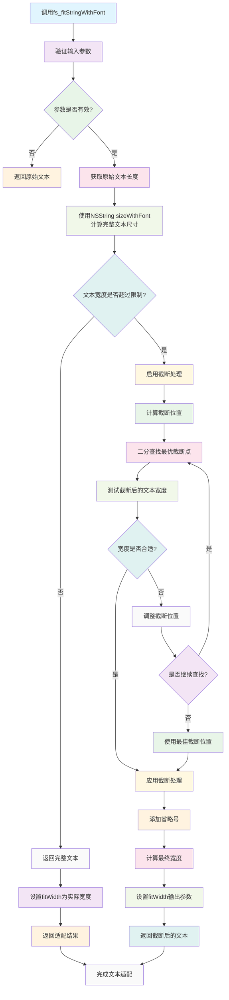

# StringFit

NSString 的文本适配扩展工具，提供智能的文本宽度计算和截断功能。

## 功能特性

- 根据指定字体和宽度计算文本显示内容
- 支持右侧截断处理
- 返回适配后的宽度信息
- 适用于 UI 布局和文本显示优化

## 工作原理流程图



## 核心方法

```objc
- (NSString *)fs_fitStringWithFont:(UIFont *)font 
                             width:(CGFloat)width 
                        truncating:(BOOL)truncating 
                          fitWidth:(CGFloat *)fitWidth;
```

### 参数说明

- `font` - 显示字体，用于计算文本尺寸
- `width` - 最大显示宽度
- `truncating` - 是否启用右侧截断
- `fitWidth` - 输出参数，返回适配后的实际宽度

## 使用示例

```objc
// 基本使用
NSString *text = @"这是一段很长的文本内容，需要根据宽度进行适配";
UIFont *font = [UIFont systemFontOfSize:16.0];
CGFloat maxWidth = 200.0;

NSString *fittedText = [text fs_fitStringWithFont:font 
                                            width:maxWidth 
                                       truncating:YES 
                                         fitWidth:NULL];

// 获取适配后的宽度
CGFloat actualWidth;
NSString *fittedTextWithWidth = [text fs_fitStringWithFont:font 
                                                     width:maxWidth 
                                                truncating:NO 
                                                  fitWidth:&actualWidth];

NSLog(@"适配后的文本: %@", fittedTextWithWidth);
NSLog(@"实际宽度: %.2f", actualWidth);
```

## 应用场景

### UI 布局优化
- 动态计算 Label 的合适宽度
- 避免文本超出容器边界
- 优化列表项的高度计算

### 文本显示控制
- 长文本的智能截断
- 保持文本的可读性
- 支持省略号显示

### 响应式设计
- 根据屏幕宽度调整文本显示
- 支持不同设备的文本适配
- 提升用户体验

## 注意事项

- 字体参数不能为 nil，否则可能导致崩溃
- 宽度参数应为正值
- 截断功能会修改原始文本内容
- 建议在 UI 更新时调用，避免频繁计算

## 版本信息

- 创建时间：2022年5月15日
- 作者：Cityu
