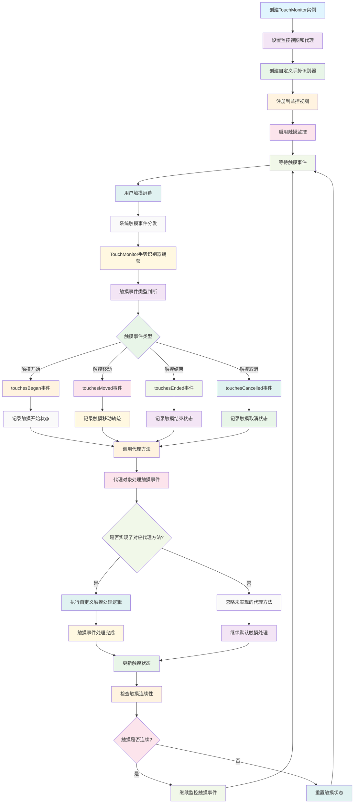

# TouchMonitor

一个轻量级的 iOS 触摸事件监控工具，支持 Objective-C 和 Swift 两种语言实现。

## 功能特性

- 🖐️ 实时监控触摸事件（开始、移动、结束、取消）
- 🔄 支持同时识别多个手势识别器
- ⚡ 高性能，不影响原有触摸事件处理
- 🎯 精确的触摸事件捕获
- 🌐 支持 Objective-C 和 Swift 项目
- 📱 兼容 iOS 8.0+

## 工作原理流程图



## 触摸事件类型

TouchMonitor 可以监控以下触摸事件：

- `touchesBegan` - 触摸开始
- `touchesMoved` - 触摸移动
- `touchesEnded` - 触摸结束
- `touchesCancelled` - 触摸取消

## 安装使用

### 手动集成

1. 将以下文件添加到你的项目中：
   - `TouchMonitor.h` 和 `TouchMonitor.m` (Objective-C 项目)
   - `TouchMonitor.swift` (Swift 项目)

2. 导入头文件或模块

### Objective-C 使用示例

```objc
#import "TouchMonitor.h"

@interface ViewController () <TouchMonitorDelegate>
@property (nonatomic, strong) TouchMonitor *touchMonitor;
@end

@implementation ViewController

- (void)viewDidLoad {
    [super viewDidLoad];
    
    // 创建触摸监控器
    self.touchMonitor = [[TouchMonitor alloc] init];
    self.touchMonitor.delegate = self;
    self.touchMonitor.view = self.view;
    self.touchMonitor.enabled = YES;
}

#pragma mark - TouchMonitorDelegate

- (void)touchMonitor:(TouchMonitor *)monitor touchesBegan:(NSSet<UITouch *> *)touches withEvent:(UIEvent *)event {
    NSLog(@"触摸开始: %@", touches);
}

- (void)touchMonitor:(TouchMonitor *)monitor touchesMoved:(NSSet<UITouch *> *)touches withEvent:(UIEvent *)event {
    NSLog(@"触摸移动: %@", touches);
}

- (void)touchMonitor:(TouchMonitor *)monitor touchesEnded:(NSSet<UITouch *> *)touches withEvent:(UIEvent *)event {
    NSLog(@"触摸结束: %@", touches);
}

- (void)touchMonitor:(TouchMonitor *)monitor touchesCancelled:(NSSet<UITouch *> *)touches withEvent:(UIEvent *)event {
    NSLog(@"触摸取消: %@", touches);
}

@end
```

### Swift 使用示例

```swift
import UIKit

class ViewController: UIViewController, TouchMonitorDelegate {
    
    private var touchMonitor: TouchMonitor!
    
    override func viewDidLoad() {
        super.viewDidLoad()
        
        // 创建触摸监控器
        touchMonitor = TouchMonitor()
        touchMonitor.delegate = self
        touchMonitor.view = view
        touchMonitor.enabled = true
    }
}

// MARK: - TouchMonitorDelegate

extension ViewController {
    
    func touchesBegan(_ monitor: TouchMonitor, touches: Set<UITouch>, with event: UIEvent?) {
        print("触摸开始: \(touches)")
    }
    
    func touchesMoved(_ monitor: TouchMonitor, touches: Set<UITouch>, with event: UIEvent?) {
        print("触摸移动: \(touches)")
    }
    
    func touchesEnded(_ monitor: TouchMonitor, touches: Set<UITouch>, with event: UIEvent?) {
        print("触摸结束: \(touches)")
    }
    
    func touchesCancelled(_ monitor: TouchMonitor, touches: Set<UITouch>, with event: UIEvent?) {
        print("触摸取消: \(touches)")
    }
}
```

## 核心属性

| 属性 | 类型 | 说明 |
|------|------|------|
| `enabled` | `BOOL` | 是否启用触摸监控 |
| `view` | `UIView *` | 要监控触摸事件的视图 |
| `delegate` | `id<TouchMonitorDelegate>` | 触摸事件代理对象 |

## 技术实现

TouchMonitor 通过自定义的 `UIGestureRecognizer` 子类来实现触摸事件监控：

- 使用手势识别器捕获触摸事件
- 通过代理模式将触摸事件传递给外部
- 支持同时识别多个手势识别器
- 不干扰原有的触摸事件处理流程

## 注意事项

1. **内存管理**: 确保在视图控制器销毁时正确设置 `view` 为 `nil`
2. **性能考虑**: 在不需要监控时，建议将 `enabled` 设置为 `NO`
3. **代理方法**: 所有代理方法都是可选的，可以根据需要实现

## 系统要求

- iOS 8.0+
- Xcode 8.0+
- Objective-C 或 Swift 4.0+

## 作者

YLCHUN-Cityu - 创建于 2023年3月20日

## 贡献

欢迎提交 Issue 和 Pull Request！

## 相关链接

- [iOS 触摸事件处理指南](https://developer.apple.com/documentation/uikit/touches_presses_and_gestures)
- [UIGestureRecognizer 文档](https://developer.apple.com/documentation/uikit/uigesturerecognizer)
