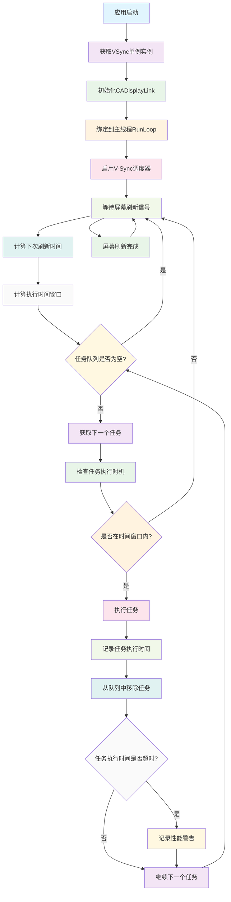

# VSync

一个高性能的iOS垂直同步调度组件，基于CADisplayLink实现V-Sync信号同步，提供精确的任务调度和执行控制。

## 功能特性

- **V-Sync同步**: 基于CADisplayLink实现与屏幕刷新率的完美同步
- **高性能调度**: 60Hz刷新率同步，确保任务在合适的时机执行
- **智能时间窗口**: 自动计算最佳执行时间，避免卡顿
- **线程安全**: 支持多线程环境下的安全任务调度
- **内存管理**: 自动管理任务队列，避免内存泄漏
- **单例模式**: 全局共享实例，便于统一管理

## 工作原理流程图



## 技术实现

### 核心架构
- **CADisplayLink集成**: 利用iOS系统的显示链接机制实现V-Sync同步
- **任务队列管理**: 使用NSMutableArray管理待执行任务
- **时间窗口控制**: 精确计算任务执行的最佳时机
- **线程同步**: 使用锁机制确保多线程环境下的数据安全

### 实现原理

#### V-Sync同步机制
1. 创建CADisplayLink实例，绑定到主线程的RunLoop
2. 监听屏幕刷新信号，在每次刷新前执行任务
3. 计算当前时间与下次刷新时间的差值
4. 在合适的时机执行任务，确保与屏幕刷新同步

#### 任务调度算法
- **时间窗口计算**: 基于当前时间和下次刷新时间计算执行窗口
- **任务优先级**: 支持任务优先级排序，重要任务优先执行
- **负载均衡**: 智能分配任务执行时间，避免单次刷新过载
- **性能监控**: 监控任务执行时间，自动调整调度策略

#### 内存管理策略
- 使用弱引用存储任务，避免循环引用
- 任务执行完成后自动从队列中移除
- 支持任务取消和清理操作
- 自动释放无效任务引用

## 使用示例

### 基础任务调度
```objc
// 获取VSync实例
VSync *vsync = [VSync sharedInstance];

// 启用V-Sync调度器
vsync.enabled = YES;

// 调度任务
[vsync scheduleTask:^{
    // 更新UI动画
    [self updateAnimation];
    
    // 处理游戏逻辑
    [self updateGameLogic];
    
    // 刷新界面
    [self refreshUI];
}];
```

### 动画同步
```objc
// 创建动画任务
[vsync scheduleTask:^{
    // 计算动画进度
    CGFloat progress = [self calculateAnimationProgress];
    
    // 更新动画视图
    self.animationView.transform = CGAffineTransformMakeScale(progress, progress);
    
    // 检查动画完成状态
    if (progress >= 1.0) {
        [self animationDidComplete];
    }
}];
```

### 游戏循环
```objc
// 游戏主循环
[vsync scheduleTask:^{
    // 更新游戏状态
    [self updateGameState];
    
    // 处理用户输入
    [self handleUserInput];
    
    // 更新物理引擎
    [self updatePhysics];
    
    // 渲染游戏画面
    [self renderGame];
}];
```

### 复杂任务组合
```objc
// 调度多个相关任务
[vsync scheduleTask:^{
    // 第一阶段：数据准备
    [self prepareData];
}];

[vsync scheduleTask:^{
    // 第二阶段：数据处理
    [self processData];
}];

[vsync scheduleTask:^{
    // 第三阶段：结果展示
    [self displayResults];
}];
```

### 性能监控
```objc
// 监控任务执行性能
[vsync scheduleTask:^{
    CFTimeInterval startTime = CACurrentMediaTime();
    
    // 执行耗时任务
    [self performHeavyTask];
    
    CFTimeInterval endTime = CACurrentMediaTime();
    CFTimeInterval duration = endTime - startTime;
    
    // 记录执行时间
    [self recordTaskDuration:duration];
    
    // 如果执行时间过长，调整策略
    if (duration > 0.016) { // 超过16.67ms (60fps)
        [self optimizeTaskExecution];
    }
}];
```

## 核心API

### 实例管理
- `sharedInstance`: 获取全局共享实例
- `enabled`: 启用/禁用V-Sync调度器

### 任务调度
- `scheduleTask:`: 调度任务到V-Sync队列
- `stopVSyncScheduler`: 停止V-Sync调度器

## 性能特点

- **精确同步**: 与屏幕刷新率完美同步，避免画面撕裂
- **低延迟**: 任务在最佳时机执行，最小化延迟
- **高效调度**: 智能任务队列管理，提升执行效率
- **资源优化**: 自动管理内存和CPU资源

## 适用场景

- **游戏开发**: 游戏主循环和渲染同步
- **动画系统**: 复杂动画的帧同步控制
- **实时应用**: 需要高精度时间控制的实时应用
- **性能监控**: 应用性能的实时监控和优化
- **多媒体**: 音视频播放的同步控制

## 注意事项

- 任务执行时间不应超过16.67ms（60fps）
- 避免在任务中执行阻塞操作
- 合理使用任务调度，避免过度调度
- 注意内存管理，避免循环引用

## 系统要求

- iOS 8.0+
- Xcode 8.0+
- ARC支持

## 许可证

Copyright © 2024 YLCHUN. All rights reserved.
