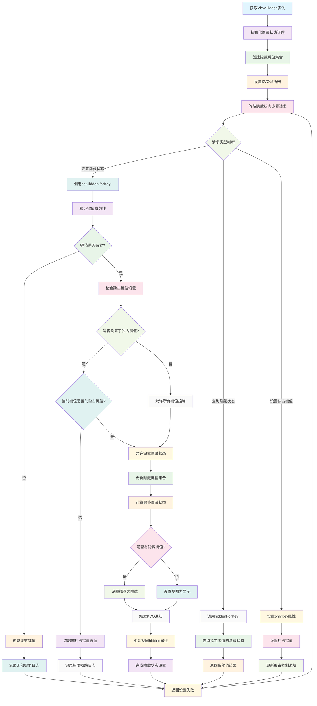

# ViewHidden

一个功能完善的 iOS 视图隐藏管理组件，提供基于键值对的视图隐藏状态管理，支持多状态控制、KVO 监听和智能隐藏逻辑。解决到处Hidden导致的结果混乱。

## 功能特性

- **多状态管理**: 支持通过不同的 key 来管理视图的隐藏状态
- **智能隐藏逻辑**: 提供 `onlyKey` 机制，支持独占式隐藏控制
- **KVO 支持**: 自动监听视图的 hidden 属性变化，支持双向绑定
- **内存安全**: 使用弱引用避免循环引用，自动管理内存
- **简单易用**: 通过 UIView 分类提供便捷的访问方式

## 工作原理流程图

## 安装使用

将 `ViewHidden.h`